# vLLM Ascend Profiling 分析指南

> **适用读者**：使用昇腾（Ascend）NPU 做 vLLM 推理性能分析的工程师，希望看懂一份 profiling 产物并从中定位性能瓶颈。
>
> **工具环境**：CANN Profiling 产物 + MindStudio Insight（timeline 可视化）+ Excel/WPS（CSV 表格分析）。
>
> **本文内容**：profiling 产物结构、`kernel_details.csv` 与 `trace_view.json` 的解读方法、三个典型分析案例、FAQ。

---

## 目录

| 节 | 主题 |
| --- | --- |
| 1 | Profiling 文件结构 |
| 2 | op_statistic.csv —— 算子统计表 |
| 3 | kernel_details.csv —— 算子明细表 |
| 4 | trace_view.json 与 MindStudio Insight timeline |
| 5 | 案例 1：DeepSeek-V4 共享专家多流 CV 掩盖 |
| 6 | 案例 2：定位空泡对应的代码侧行为（host bound） |
| 7 | 案例 3：多卡 profiling 对齐与快慢卡分析 |
| 8 | FAQ |
| 9 | 附录：术语速查 |

---

## 1. Profiling 文件结构

一份 profiling 采集落盘后的目录结构如下：

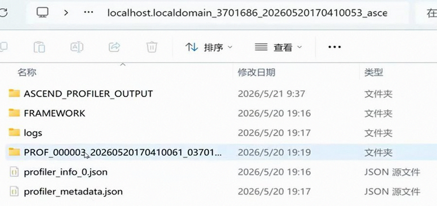

图 1：profiling 落盘目录，<code>PROF_xxx</code> 为原始数据，<code>ASCEND_PROFILER_OUTPUT</code> 为解析产物

其中 `PROF_xxx` 是采集的**原始数据**，`ASCEND_PROFILER_OUTPUT` 是工具**解析后的产物**。日常分析只使用解析产物，因此在下载或向他人分发 profiling 时，可以**删掉原始数据**以节省磁盘空间。

只有一种情况需要保留原始数据：**认为解析结果不正确时**，需要把原始数据提供给工具侧同事定位问题。

### 1.1 解析产物一览

我们日常使用的数据都在 `ASCEND_PROFILER_OUTPUT` 里：

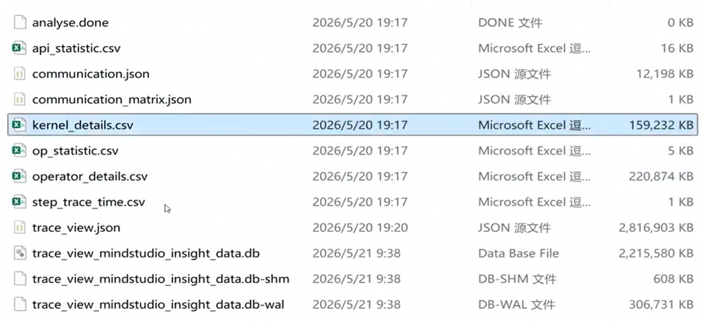

图 2：<code>ASCEND_PROFILER_OUTPUT</code> 目录内容

其中最常用的两个文件：

- **`trace_view.json`**：用 MindStudio Insight 打开后是一条与代码执行顺序完全一致的时序图（timeline）；
- **`kernel_details.csv`**：一张从前到后排列的时间轴明细表，同样与代码执行顺序完全对应。

目录中其余文件的定位如下（了解即可，日常分析基本不涉及）：

| 文件 | 说明 |
| --- | --- |
| `kernel_details.csv` | 算子级执行明细，**本文重点** |
| `trace_view.json` | timeline 数据源，MindStudio Insight 打开，**本文重点** |
| `op_statistic.csv` | 算子维度统计汇总（见第 2 节） |
| `api_statistic.csv` | API 维度统计，主要供 CANN / 算子侧定位使用，推理框架侧几乎不关注 |
| `operator_details.csv` / `step_trace_time.csv` | 算子与迭代级明细，本文不涉及 |
| `communication.json` / `communication_matrix.json` | 通信数据与通信矩阵，本文不涉及 |
| `analyse.done` | 解析完成标记文件 |

接下来进入重点：`trace_view.json` 与 `kernel_details.csv`。

## 2. op_statistic.csv —— 算子统计表

`op_statistic.csv` 是解析生成的算子维度统计表：

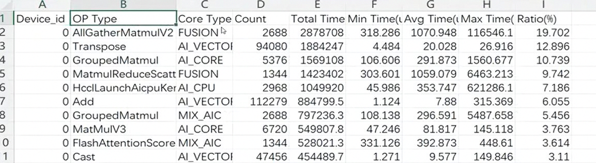

图 3：<code>op_statistic.csv</code> 按 OP Type 汇总的统计结果

关键列说明：

| 列 | 含义 |
| --- | --- |
| `Device_id` | 卡号 |
| `OP Type` | 算子类型 |
| `Core Type` | 算子在哪个核上执行 |
| `Count` | 该算子一共执行了多少次 |
| `Total Time` | 该算子累计执行时间 |
| `Min Time` / `Avg Time` / `Max Time` | 单次执行的最小 / 平均 / 最大耗时 |
| `Ratio(%)` | 该算子耗时占比 |

这张表的实际使用频率并不高，主要用途是**看哪些算子占比高，形成一个宏观的待优化排序**。相比推理，它在训练场景用得更多；推理场景下通常直接从 `kernel_details.csv` 里把一层切出来单看（见下节），粒度更合适。

## 3. kernel_details.csv —— 算子明细表

### 3.1 基本使用流程

拿到一份推理 profiling 后，`kernel_details.csv` 的常规操作步骤：

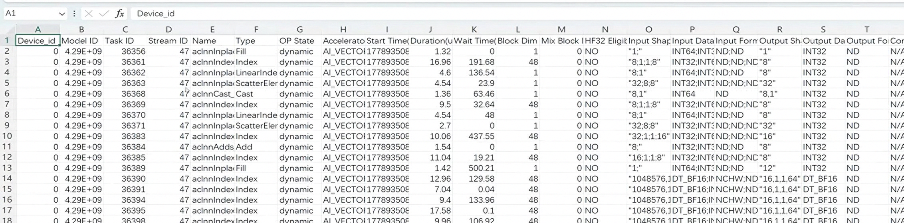

图 4：<code>kernel_details.csv</code> 打开后的原始状态

1. **冻结首行**，方便左右滑动时始终看到表头；
2. **按 `Start Time` 排序**——采集时记录顺序不一定是从前到后的，先排序保证时间轴正确；
3. **把"一层"切出来**（一般拉到表格后段）。一层的起点和终点算子依模型而定：以 DeepSeek-V4（dsv4）为例，一层的起点一般是 `HCPrevInv...` 一类算子，终点一般是 `HCPost_...` 一类算子；
4. **把第 3 步选出的行复制到第二个 sheet**，并把表头一并拷贝过去。

切出单独一层后的表如下：

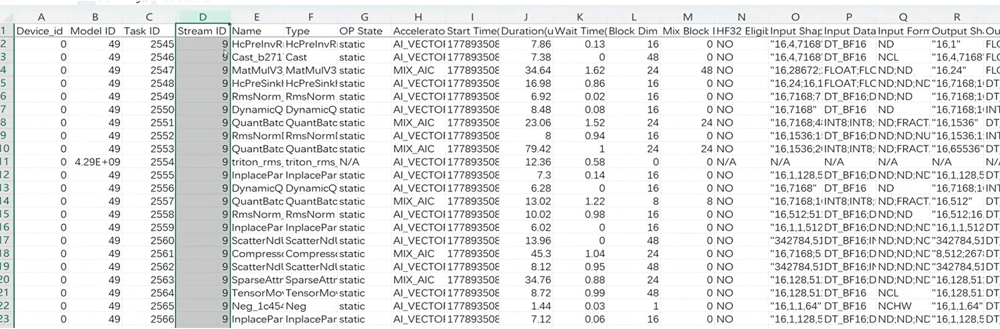

图 5：从原表切出的一层数据（Sheet2），首行即 <code>HcPreInvR...</code> / <code>HcPreSinkI...</code> 边界算子

### 3.2 字段说明

对这张单层表，各字段的关注点如下（按列顺序）：

| 字段 | 说明 |
| --- | --- |
| `Device_id` | 卡号，无需特别关注 |
| `Model ID` | 几乎不用关注，目前基本不遇到多模型场景 |
| `Task ID` | 不用关注，供 RTS 使用——所有算子都会包装成一个 Task 交给 RTS 下发给芯片执行 |
| **`Stream ID`** | **需要关注**，见下文 |
| `Name` | 算子的执行名字，全局唯一 |
| `Type` | 算子类型，多个不同名字的算子可归属同一类型 |
| `Op State` | 算子是静态（static）还是动态（dynamic）；例如 `npu_graph_ex` 提供 `enable_static_kernel` 配置，可让算子变成静态的，进一步提高运行时速度 |
| `Accelerator` | 算子使用的计算单元，见下文 |
| `Start Time` | 起始时间，3.1 步骤 2 排序的就是这一列，它与代码执行顺序完全对应 |
| `Duration` | 算子执行时间，**其中包含算子的调度等待时间，这就是我们要优化、要削减的值** |
| `Wait Time` | 等待时间，低阶优化用不到，可以先不看 |
| `Block Dim` | 算子使用的核数；值是 48 一定是 752T 机型（该机型才有 48 核，对应 CUBE 核 24 个）。注意该值有时统计得并不准 |
| `Input Shapes` | 算子输入的 shape |
| `Input Data Types` | 输入数据类型（BF16 / FP16 / INT8 等）；单元格内的分号用于分隔多个 tensor 的输入 |
| `Input Format` | 输入排布格式（区别于 Data Type）：`ND` 是标准格式；`NZ`、`ZN` 等是昇腾私有格式，是针对芯片设计的更优排布，但格式转换本身会带来开销 |
| `Output` 三列 | 与 Input 对应（Shape / Data Types / Format），不再展开 |
| `Context ID` | 不用管 |

**Stream ID 为什么重要**：流的划分体现了并行设计。以本文示例这份 profiling 为例，`9` 是主流；`8` 是通信流（多条流的目的一般就是为了并行）；`7` 对应共享专家多流，目的是让共享专家与主流并行执行、相互掩盖。如果想验证"共享专家多流有没有生效"，看这条流即可。在 MindStudio Insight 的图形化界面里可以看到：`7` 上有一个 matmul 融合算子（共享专家），`8` 是通信流，`9` 是主流——`7` 上的 matmul 与 `9` 上的 moe dispatch 在时间上是并行的；即使没有图形化界面，纯看表格也能得出同样结论。

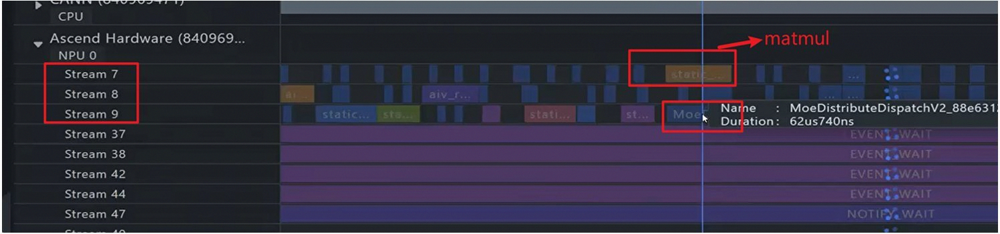

图 6：MindStudio Insight 图形化界面，Stream 7 上的 matmul（共享专家）与 Stream 9 上的 MoeDistributeDispatchV2（主流）并行执行

**Accelerator 的取值**：芯片上有三类计算单元——`CUBE`（矩阵计算）、`VECTOR`（向量计算）和 `AICPU`。表中 `AI_VECTOR_CORE` 表示纯 VECTOR 算子；`AI_CORE` 表示 CUBE 算子；`MIXED_AIC` 表示既走了 CUBE 又走了 VECTOR。

通过 Input / Output 三组列的对比，可以非常清晰地发现算子内部执行的 Cast、数据类型变化以及 shape 变化。

### 3.3 后段性能指标列：CUBE 与 VECTOR 各看两列

表格后段的指标列不需要全部关注，按算子类型只看以下几列（可以先把某一行标注为黄色便于对照）：

**CUBE（`AI_CORE`）算子**——典型的是纯 MATMUL 计算（MATMUL、GMM 或其融合算子）：

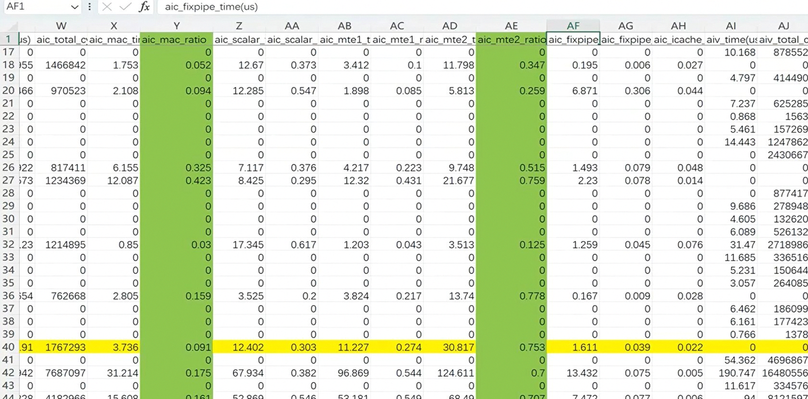

图 7：CUBE 算子的性能指标列，重点看 <code>aic_mac_ratio</code> 与 <code>aic_mte2_ratio</code>

| 指标 | 含义与关注方式 |
| --- | --- |
| `aicore_time` | 算子执行时间；该值本身高低对分析意义不大 |
| **`aic_mac_ratio`** | CUBE 利用率，**越高越好**；达到 0.9 以上可认为是计算 bound 场景。prefill 阶段可以尽量往高打，decode 阶段则不太现实；过低说明 CUBE 能力没有发挥出来，可以此向算子侧提出优化诉求 |
| **`aic_mte2_ratio`** | CUBE 指令从 HBM 搬运到 L1 的资源占比，**越低越好**；达到 0.9 以上说明严重缓存 bound |
| `aic_scalar_ratio` / `aic_mte1_ratio` / `aic_fixpipe_ratio` | 平时不用关注（`mte1` 是算子内部 L1 → L0 的搬运指标；`fixpipe` 是 `A@B=C` 计算完成后走的结果输出管线，均与推理框架调优关系不大） |

**VECTOR（`AI_VECTOR_CORE`）算子**：

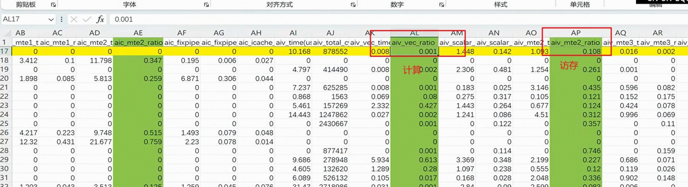

图 8：VECTOR 算子的性能指标列，重点看 <code>aiv_vec_ratio</code> 与 <code>aiv_mte2_ratio</code>

| 指标 | 含义与关注方式 |
| --- | --- |
| **`aiv_vec_ratio`** | VECTOR 计算单元的执行效率，**越高越好** |
| **`aiv_mte2_ratio`** | 从 HBM 搬运到 UB Buffer 的资源占用，高了代表缓存 bound，**越低越好** |
| `aiv_mte3_ratio` 等 | 搬出方向的指标，平时不用管 |

总的原则：**计算 bound 越多越好，缓存 bound 越少越好**。我们本质上要的是计算结果，缓存与通信都是为达成计算而不得不付出的开销。

### 3.4 补充 total / ratio 两列，直观看瓶颈

除了表格自带的信息，建议在 `Duration` 和 `Wait Time` 之间手动插入两列：

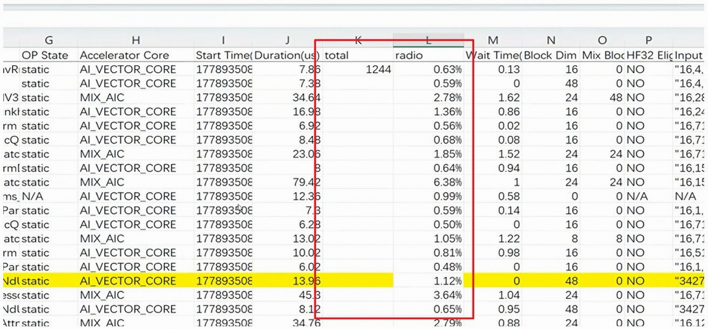

图 9：在 <code>Duration</code> 与 <code>Wait Time</code> 之间插入 <code>total</code>、<code>ratio</code> 两列

- **`total`**：对本层所有行的 `Duration` 求 SUM，表示这一层的大概耗时。之所以说"大概"，是因为该算法没有把流间掩盖算进去，比较粗糙，但基本够用；
- **`ratio`**：`Duration / total`，即该算子在本层的耗时占比（单元格格式设为百分比）。

这样就能直观看到瓶颈出在哪里。若需要更精确，可把其他流上被掩盖的部分剔除后再统计。

## 4. trace_view.json 与 MindStudio Insight timeline

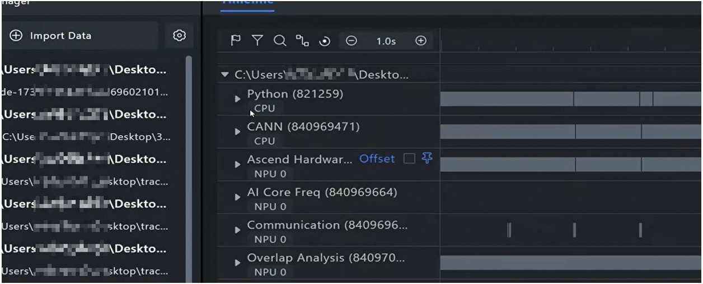

图 10：MindStudio Insight 打开 trace_view.json 后的 timeline 总览

把 profiling 导入 MindStudio Insight 后，界面分为以下几个纵向泳道：

| 泳道 | 内容 | 关注要点 |
| --- | --- | --- |
| `Python` | 代码层，展开后可看到算子下发的调用栈，vLLM 的模型代码被拆分成若干接口完成下发，看得非常清楚 | 见图 11 |
| `CANN`（Runtime / RTS 层） | 任务进队 / 出队 | 平时不用太关注，芯片 / 底层运行时侧关注较多 |
| `Ascend Hardware` | 算子执行的真实时间流 | 见图 12 |
| `AI Core Freq` | 芯片频率 | 期望是平稳长条；出现锯齿状说明有降频，直接怀疑硬件问题（Atlas A2 系列出现过），见图 13 |
| `Communication` | 通信流单独拆成的大模块 | 有的 profiling 会把算子执行流里的通信单独拉出；想与原流对应时，标记起始和结束两段即可 |
| `Overlap Analysis` | 掩盖统计 | 见下文及图 14 |

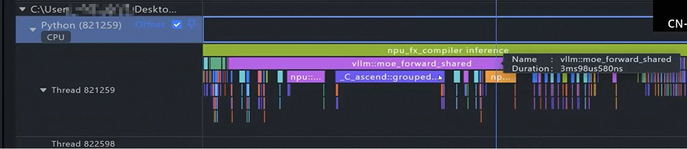

图 11：<code>Python</code> 泳道展开后的下发调用栈（forward → torch 层接口）

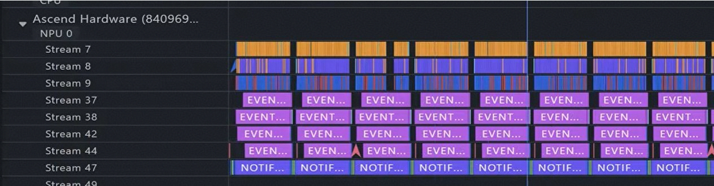

图 12：<code>Ascend Hardware</code> 泳道，NPU 下的各条 Stream

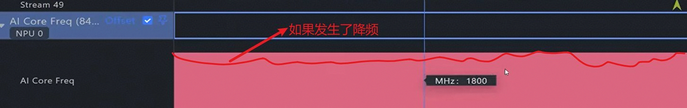

图 13：<code>AI Core Freq</code> 频率曲线，期望全程平稳（如图），锯齿状即降频

**Overlap Analysis 泳道**是掩盖统计：其中"通信未掩盖"在训练场景比较重要，推理场景该值一般不高；我们关注**计算流越密集越好**。`Free` 表示调度空闲——NPU 喂不饱时就会产生 Free，越少越好。注意该统计只能反映大概，比较粗糙。

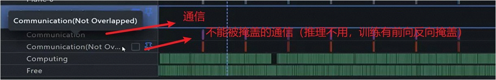

图 14：<code>Overlap Analysis</code> 泳道的掩盖统计

接下来重点看 `Ascend Hardware` 这一层。对推理任务而言，**一次 decode 周期在 profiling 里能非常明显地看出来**——算子块呈周期性重复：

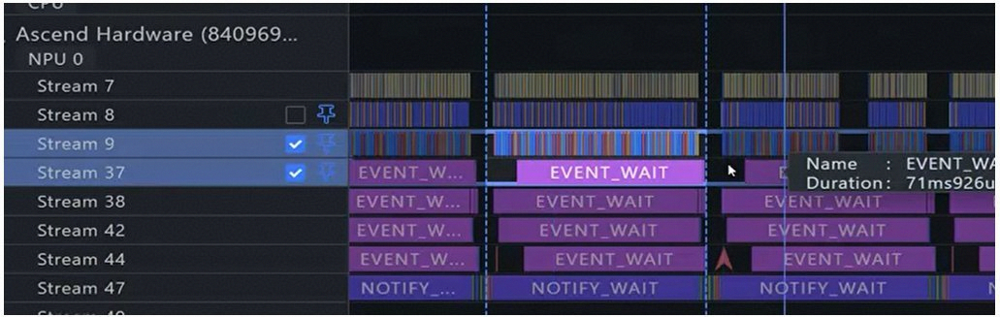

图 15：推理 decode 阶段的周期性算子模式

分析时只需取其中一个 decode 周期；再在该周期内取一层，直接放大，按 3.1 节的方式找到一层的起始算子和结束算子，框选即可。

## 5. 案例 1：DeepSeek-V4 共享专家多流 CV 掩盖

本案例偏细节，记录实际分析 profiling 时看到的各种现象及解释，供读者参考。

### 5.1 CV 掩盖的基本形态

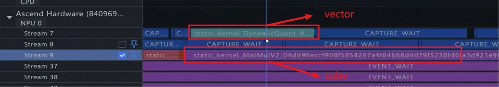

图 16：<code>dynamic_quant</code>（VECTOR）与 <code>MatMulV2</code>（CUBE）时间上并行

图中 `dynamic_quant` 是 VECTOR 算子，`MatMulV2` 是 CUBE 算子。这种并行是**计算与计算的掩盖**：CUBE 单元与 VECTOR 单元是不同的计算硬件，天然可以并行。需要注意的是两者的 mte2 是公用的，即数据搬运资源会互相抢占。

> **CV 掩盖**：即 CUBE 与 VECTOR 两个计算单元之间的执行掩盖，是最常用的并行手段之一。

### 5.2 共享专家多流的四步并行

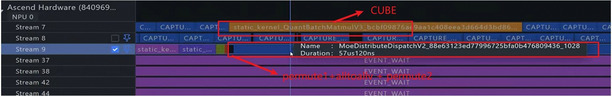

图 17：共享专家多流——上方的 bmm（CUBE）与下方的 dispatch 融合算子并行

图 17 即前文提到的共享专家多流：上面的 `bmm` 算子是典型的 CUBE 操作；下面的 dispatch 是三个小算子的融合（permute1 + alltoallv + permute2），其中 permute 是典型 VECTOR 操作、alltoall 是通信。这里的掩盖更复杂，涉及 **CUBE 计算、VECTOR 计算、通信**三者的掩盖。

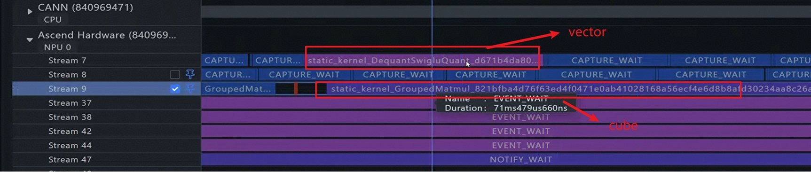

图 18：共享专家多流——<code>dequant_swiglu_quant</code>（VECTOR，Stream 7）与 <code>GMM</code>（CUBE，Stream 9）并行

图 18 中，共享专家流上的 `dequant_swiglu_quant` 是纯 VECTOR 操作，主流上的 GMM 是纯 CUBE 操作，同样构成 CV 并行。

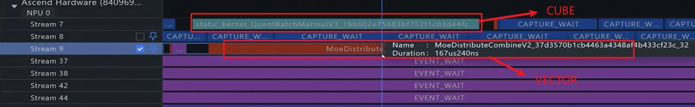

图 19：共享专家多流——<code>BMM</code>（CUBE）与 <code>combine</code>（unpermute1 + alltoallv + unpermute2）并行

图 19 是共享专家多流的下一个阶段：上面的 BMM 是 CUBE 操作，下面的 combine 由 unpermute1 + alltoallv + unpermute2 三个小算子融合而成，是 VECTOR 与通信的串行，结构与图 17 的 bmm/dispatch 并行类似。

以上四步就是共享专家多流的完整过程，并行利用得非常充分，这也是它能成为生产环境可用特性的原因。同理，Attention 部分也完全可以做 CV 并行——分析模型的计算流程后即可设计出这样的并行。

### 5.3 入图与不入图的排布差异

前面几个例子里的算子排布都非常紧密，因为这部分是**入图**（图模式）执行的。对比 MTP 不入图的部分，能明显感觉算子稀稀拉拉：

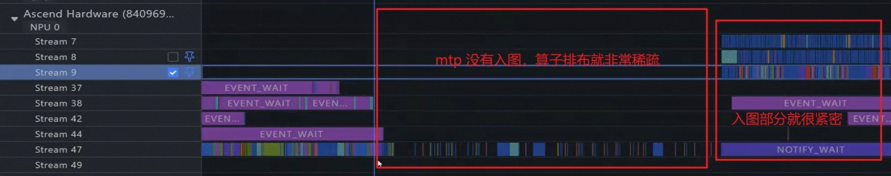

图 20：MTP 不入图部分，算子排布明显稀疏

在这段空白处框选一块，下方 Free 泳道会打出绿色标签，印证了前文对 Free 的解释：

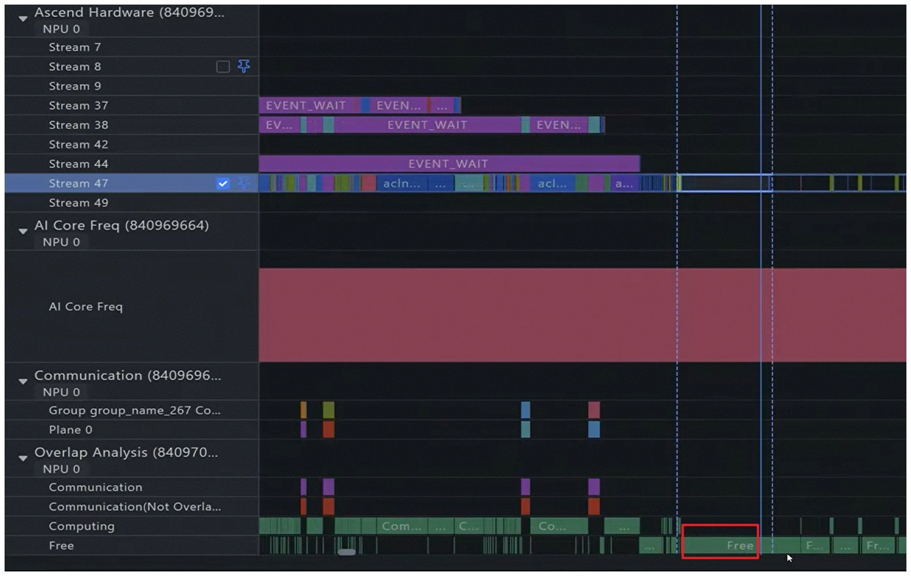

图 21：框选空白区间，Free 泳道打出绿色标签（调度空闲）

另外可以注意到：**纯通信期间 Free 也不会变绿**。因此可以把 Free 理解为"既没有计算也没有通信"的时间：

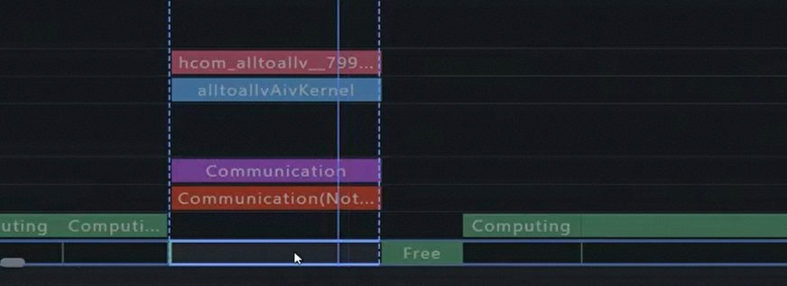

图 22：纯通信时间段内 Free 泳道不变绿

### 5.4 EVENT_WAIT 的排查方法

分析 profiling 时会看到大量 `EVENT_WAIT`：一部分是入图产生的，一部分是通信产生的。想知道某个 `EVENT_WAIT` 期间在做什么，常见做法是把该时间段框起来，然后看其他流上有没有线索：

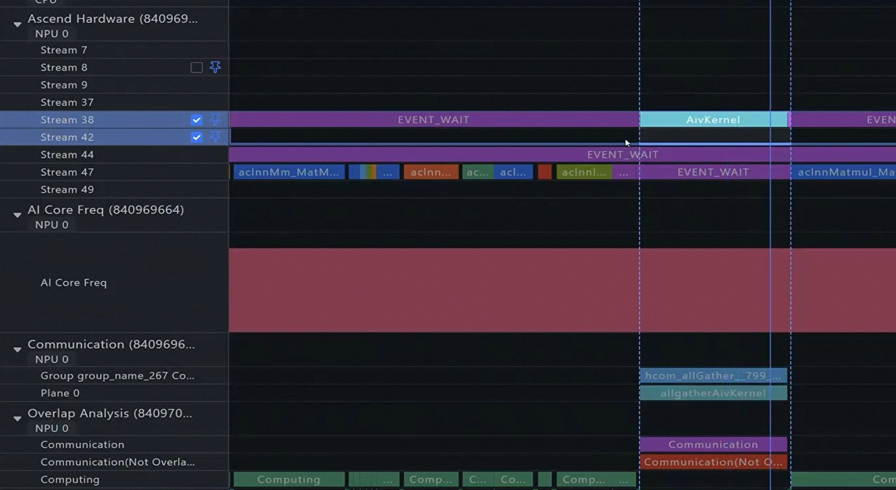

图 23：框选主流上的 <code>EVENT_WAIT</code>/<code>AivKernel</code>，往下看发现此时在做 AllGather 通信

如图 23，主流上的 `AivKernel` 单看主流不知道在做什么，但框选后往下看，就能发现这个时间点在做 AllGather 通信。

## 6. 案例 2：定位空泡对应的代码侧行为（host bound）

先补充一个小点：训练 profiling 不像推理那样规整。想判断什么时候进入反向阶段——**看到 Grad 相关算子就是反向**：

图 24：训练 profiling，出现 Grad 算子即代表反向阶段

### 6.1 通过 profiling 找空泡来源

本节讲如何通过 profiling 看一个算子对应哪个 Python 调用栈，从而弄清算子前后发生了什么，通常用于分析 host bound 场景。

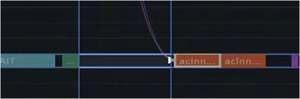

图 25：<code>aclnnGMM</code> 算子前面有一大片空泡

看到 `aclnnGMM` 前面空了一大片，想知道空泡从哪来。一种办法是打 core_stack 并关闭图模式，直接看到该算子对应 Python 脚本的哪一行；另一种就是本节介绍的，直接在 profiling 里分析。

在**不开启图模式**的情况下，点击该算子，可以看到一条连线向上连到 Python 层：

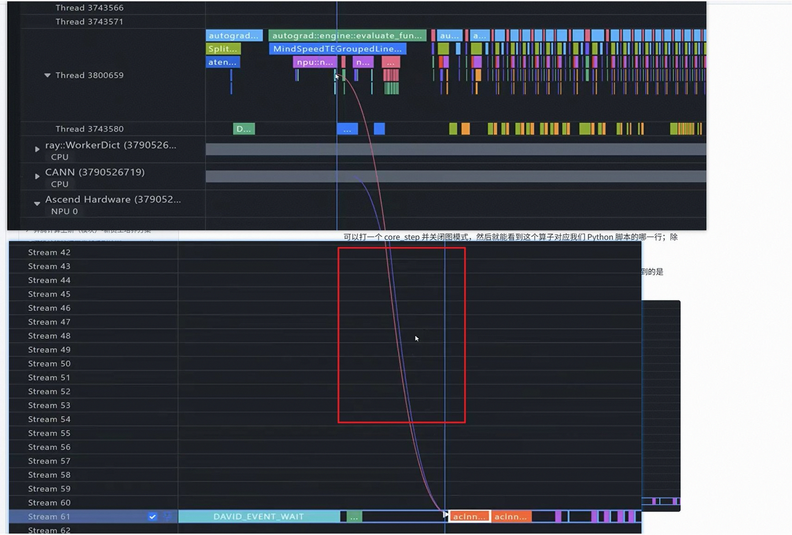

图 26：点击算子后出现连线，指向 Python 层的调用栈（如 <code>forward_with_kvc...</code>）

分析到这一步还是不知道空泡里发生了什么，此时要**往前找**：找空泡前面那个绿色算子对应的 Python 层调用栈：

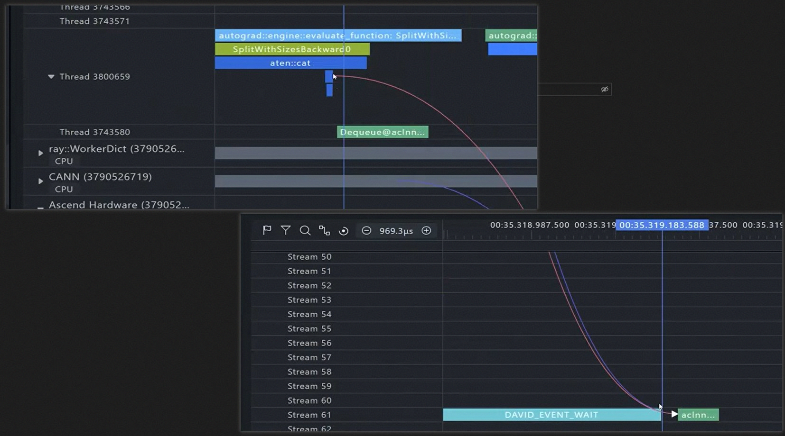

图 27：往前找空泡前绿色算子（如 MatmulKernel）的 Python 调用栈（<code>forward_with_kvcache</code> / <code>forward_chunk</code>）

这样就能知道这段空白里发生了什么。此处不再展开，典型原因是：**上一个算子算得太快，下一个算子还没来得及下发，自然无法开始计算**——通常对应 shape 非常小的场景，容易发生 host bound。虽然这是一个训练的例子，但对推理有完全相同的借鉴意义。

两点补充：

- 上述定位方式的前提是**不能开图模式**：一开图模式，算子完全不由 Python 代码下发，连线方式失效（但 Free 统计仍有效，见 FAQ Q2）；
- 对代码不熟悉的人，即使看到了 Python 调用流也难以对应到具体代码，此时可以打印 core_stack 定位到具体代码位置（配置项：`profiler_config.torch_profiler_with_stack`）。

### 6.2 host bound 空泡的消除方法

1. **审视代码逻辑**：这段逻辑是否必要，能否优化或删除；
2. **等价转移**：逻辑必要的话，能否挪到其他位置做等价处理；
3. **调整下发顺序**：考虑把后面高运算负载的算子先下发，再下发这个低运算负载的算子（前提是两者顺序可以调换）；
4. **检查绑核**：host bound 问题有时是绑核没做好，频繁切核会拉长下发调度时间；
5. **入图**：让这部分代码入图、下沉到 RTS 侧，就不存在 Python 下发导致的空泡。

### 6.3 通信带宽的评估方法

点击一个通信算子，查看下方的 detail 信息：

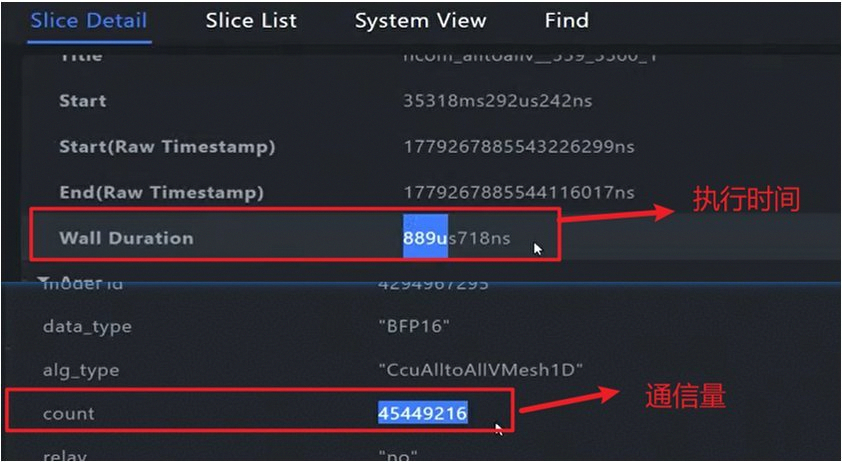

图 28：通信算子（如 <code>HcclAllGather...</code>）的 detail 面板

**通信带宽 = 通信量 ÷ 执行时间**，常用单位 **GB/s**。通信量需要按 dtype 折算成字节数（BF16 ×2、FP32 ×4）。

判断带宽是否合理：需要对照所用机型、通信算子与 shape 下的理论带宽数据（可查阅机器规格与通信库文档，或所在团队的基线数据）。若实测明显低于理论值，应找通信算子侧优化。

> 注意：部分通信算子的带宽计算还需要乘以或除以通信域大小，具体以算子文档为准。

### 6.4 两个实用技巧

**搜索算子**：想找一个算子但找不到时，可以在 MindStudio Insight 上方搜索框搜索该算子（文件较大时可能需要多加载一会儿）。双击搜索结果即可看到 Python 代码与算子执行的下发关系，非常清晰。

**只有 timeline 时的层耗时统计**：如果没看 `kernel_details.csv`、只拿到 timeline，想知道一层耗时多少：框选一个区域后，下方会出现 Slice List，展示范围内所有算子的统计量：

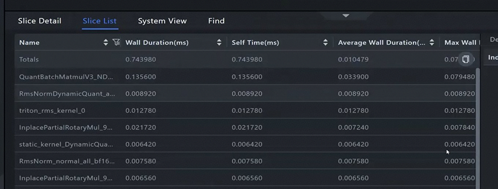

图 29：框选区域后下方的 Slice List 统计面板

下方的 System View 也会展示一个大概的通信 / 计算时间占比。之所以说"大概"，是因为通算融合算子无法展开计算内部的时间占比：

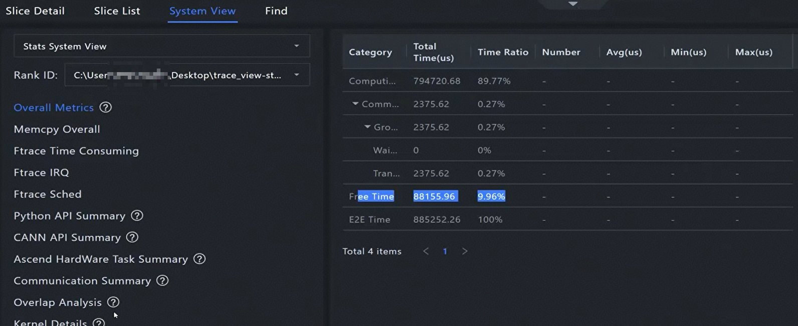

图 30：System View 展示的通信 / 计算时间占比（粗略）

## 7. 案例 3：多卡 profiling 对齐与快慢卡分析

### 7.1 置顶泳道

流特别多时，想比较多张卡上对应流的差异，比较方便的做法是**置顶**：点击泳道右侧的置顶图标，把关注的流固定到一起：

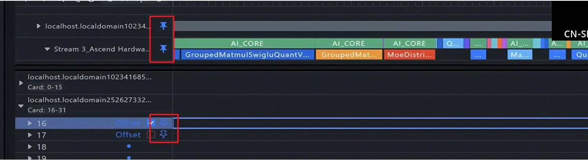

图 31：点击右侧置顶图标，把多条卡的流固定在一起比较

### 7.2 多卡时间偏差与手动对齐

把多张卡的主流放在一起比较，可以分析快慢卡：

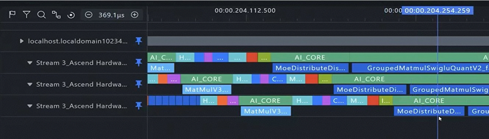

图 32：多卡主流对比，各卡的 moe 块呈阶梯状错位

图 32 中几条流进度明显不一致。这是常见的 profiling 时间统计偏差（各卡 trace 起点不一致），并不是真实的执行错位，需要手动把几个 moe 块拉齐。由于 dispatch 算子内部包含 alltoall 操作，而 alltoall 一定是全卡同步的，所以统计 trace 存在时间偏差的判断是成立的。

对齐操作：右键其中一个 `MoeDistributeDispatchV2` 算子，选择 **Set Base Slice**：

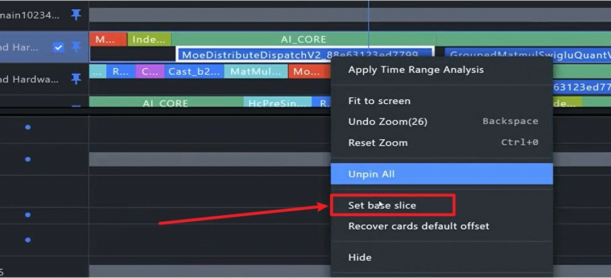

图 33：右键算子块，选择 Set Base Slice 设置基准

然后点击另一个卡上的 moe 块，按键盘 **L / R** 即可左对齐 / 右对齐，实现流偏移；也可以手动框出差值，输入数值做流偏移。下图演示的是左对齐：

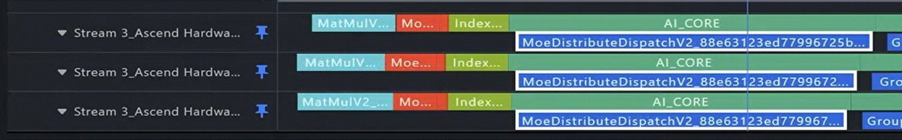

图 34：以 MoeDistributeDispatchV2 左端为基准对齐后的效果

注意：左对齐其实并不严格准确——dispatch 本质是 permute1 + alltoall + permute2 的融合，严格对齐的基准应该是 alltoall 的右端。**更推荐的做法是找一个独立的通信算子做右对齐**：

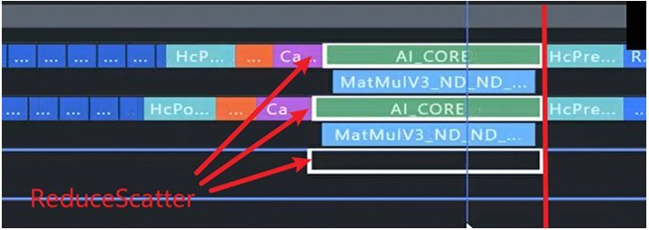

图 35：以独立通信算子（ReduceScatter）右端为基准对齐，更为准确

> 目前工具暂不支持自动对齐，需要手动设置偏移完成上述操作。

### 7.3 快慢卡判定

完成对齐后（前提是把该拉齐的都拉齐），判定快慢卡的方法：**看哪张卡上某个算子的尾部（结束点）基本对齐，然后比较执行时间——执行时间最短的那张卡就是慢卡**，因为相当于其他卡都在等它：

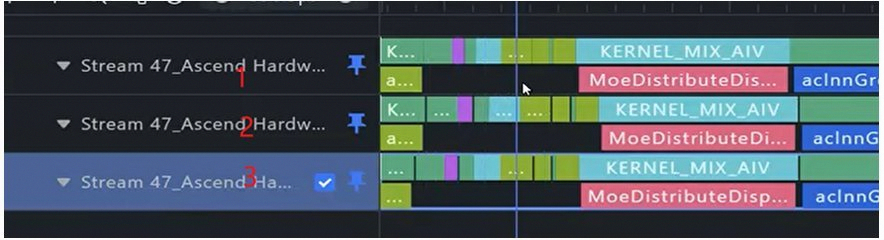

图 36：对齐后比较各卡同一算子的执行时长，最短者为慢卡

## 8. FAQ

**Q1：通算掩盖的比例是否好测算？有没有固定的合理范围？**

A1：没有固定范围，不同场景差异较大。补充一点：通算掩盖通常有两种实现方式——一是在模型代码层面优化，让通信和计算并行执行；二是做通算融合算子，在算子内部完成这种优化。

**Q2：算子下发遇到瓶颈时可以通过图模式优化，但开了图之后 profiling 看起来不方便了，怎么证明空泡到底优化了没有？**

A2：这个问题的本质是：开图之后无法通过"算子与 Python 代码之间的连线"查看对应关系。但实际上，算子之间的 Free 仍会被正确统计到——两个算子间的空泡可以看到变小。因此即便开了图模式，问题也不大。

**Q3：之前说查看算子对应 Python 行号还有一个 core_stack，具体是什么？**

A3：通过配置参数控制：`profiler_config.torch_profiler_with_stack`。

## 9. 附录：术语速查

| 术语 | 含义 |
| --- | --- |
| RTS | Runtime System，运行时调度层；所有算子包装成 Task 交给 RTS 下发给芯片执行 |
| CUBE / VECTOR / AICPU | 昇腾的三类计算单元：矩阵计算 / 向量计算 / AI CPU |
| `AI_CORE` / `AI_VECTOR_CORE` / `MIXED_AIC` | kernel_details.csv 中 Accelerator 列取值：纯 CUBE / 纯 VECTOR / CUBE+VECTOR 混合 |
| CV 掩盖 | CUBE 与 VECTOR 两类计算单元之间的执行并行与互相掩盖 |
| mte1 / mte2 / mte3 | 搬运指令资源：CUBE 侧 mte1 = L1→L0、mte2 = HBM→L1；VECTOR 侧 mte2 = HBM→UB、mte3 = UB 搬出 |
| fixpipe | CUBE 中 `A@B=C` 计算完成后输出结果的管线 |
| ND / NZ / ZN | 数据排布格式：ND 为标准格式，NZ/ZN 为昇腾私有格式（对芯片更优，但转换有开销） |
| host bound | 瓶颈在 host 侧下发/调度而非 NPU 计算的场景，timeline 上表现为算子间空泡 |
| 入图 / 图模式 | 算子经图编译下沉到 RTS 侧执行，不由 Python 逐个下发 |
| 通算融合 | 将通信与计算融合进同一算子的优化手段 |
| Free | Overlap Analysis 泳道中的调度空闲时间：既无计算也无通信的时间段 |
| 快慢卡 | 多卡推理中执行最慢、其他卡需等待它的卡 |
