# 权重加载与基础并行策略（TP、EP）· 分享 Wiki

> **主线只有一句话：一份磁盘上的权重文件，如何变成每张卡上「正确的那一块」参数。**

## 目录

| 节   | 主题                                     |
| --- | -------------------------------------- |
| 1   | 开场：权重加载在做什么                            |
| 2   | 磁盘上有什么：checkpoint 全貌                   |
| 3   | 两个并行在切什么：TP 与 EP 直觉                    |
| 4   | 入口：load_format 怎么选 loader              |
| 5   | 读盘：惰性迭代器与 EP 过滤                        |
| 6   | 核心机制：WeightsMapper 与 AutoWeightsLoader |
| 7   | TP 切分与典型计算方式                           |
| 8   | 量化挂在链路哪里（简述）                           |
| 9   | 让加载更快：提速与快速起实例                         |
| 10  | 跨实例拿权重：rfork 与 netloader               |
| 11  | 排障实战与收束                                |

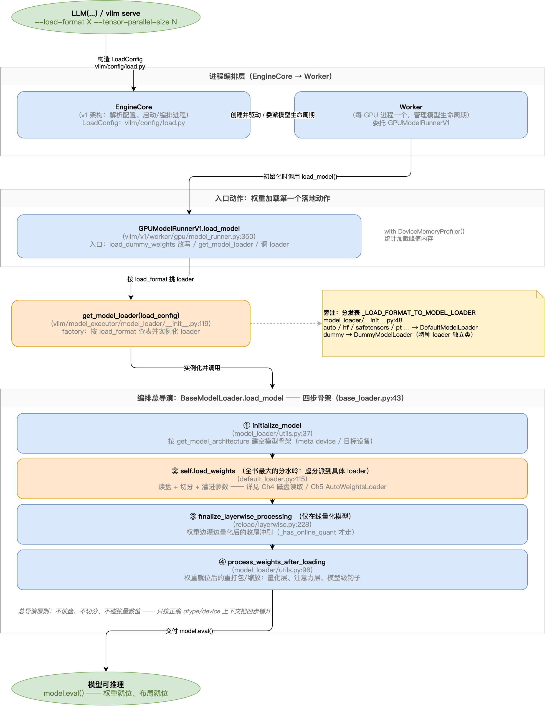

上面这张图是第 4~9 节的总地图：从 `LLM(...)` 到「模型可推理」，中间经过 loader 选择、load_model 的四步、读盘与写入。后面每一节都是在放大这张图的某一段。

---

## 第 1 节 · 开场：权重加载在做什么

> **一句话定义：权重加载 = 把硬磁盘上的模型权重文件，变成 NPU/GPU 显存里每个 rank 持有的、供 kernel 使用的参数张量。**

### 为什么它不是「拷文件」

从 Hugging Face 下载一个模型，本地是一堆文件：`config.json`、`model.safetensors`、`tokenizer.json`……其中 safetensors 文件里存着全部参数——几 GB 的张量，按一套名字组织，比如 `model.layers.0.self_attn.q_proj.weight`。这是「磁盘上的样子」。

推理引擎不能直接拿这些文件算，原因有三个。**这三个原因，反过来就是权重加载的全部工作内容：**

**第一，权重要进显存。** GPU/NPU 的 kernel（矩阵乘、归一化、MoE 路由）只认已经放到设备上的 `torch.Tensor`，不认文件。

**第二，权重不是每卡一份完整的。** 用 4 张卡做张量并行（`--tensor-parallel-size 4`），或对 MoE 模型开专家并行（`--enable-expert-parallel`）时，每张卡只需要持有一个**切片**，而不是整份拷贝。

**第三，存储用一套名字，运行用另一套名字。** HF 在磁盘上把 `q_proj/k_proj/v_proj` 分开存；vLLM 为了推理性能，在显存里把它们融合成一个 `qkv_proj`，一次大矩阵乘同时算出 QKV。磁盘上是 `gate_proj/up_proj`，显存里是融合的 `gate_up_proj`。中间这层「翻译」也是加载要干的活。

### 三个动作，对应后面几节

| 动作        | 说的是什么                         | 在哪一节展开 |
| --------- | ----------------------------- | ------ |
| **读**     | 从磁盘上把权重一条条读出来（惰性、边读边喂，不整文件吞内存） | 第 5 节     |
| **翻译**    | 把磁盘上的名字/布局映射到 vLLM 模型的参数名/布局   | 第 6 节     |
| **切分+写入** | 按 TP/EP 把权重切成每 rank 一份，写进参数   | 第 7、8 节  |

而入口（谁指挥这三个动作）在第 4 节。记住「读、翻译、切分」三个词，后面的每一节都是在展开其中一个。

### 开发者视角

- 看到加载慢或加载报错，先过一遍三动作：是读盘慢（IO）、翻译错（名字对不上）、还是切分错（shape 对不上）——这是给报错定位的第一层坐标。
- 新人常见误解是「加载 = 拷数据」。纠正这一条，很多加载报错（shape 不匹配、名字不认识）的成因就好理解了。

---

## 第 2 节 · 磁盘上有什么：checkpoint 全貌

> **一句话：config.json 定义模型结构，权重文件提供参数数值；权重靠「名字」组织，而名字就是模型模块树的路径。**

### 一个 HF 模型目录长什么样

```text
my-model/
├── config.json                      # 模型结构：层数、hidden size、head 数、architectures
├── model-00001-of-0000N.safetensors # 权重分片 1
├── model-00002-of-0000N.safetensors # …
├── model.safetensors.index.json     # 地图：哪个权重在哪个分片文件里
└── tokenizer.json 等                # 分词器，与权重加载无关
```

两个要点：

**格式上，vLLM 默认推荐 safetensors。** 它是纯数据加一个 JSON 头做校验，支持边读边流式加载、内存友好；老的 `.bin`（torch.save 产物）不保证跨版本稳定，且有反序列化安全风险。`load_format="auto"`（默认值）的行为就是「优先 safetensors，没有才回退 .bin」。

**大模型必然分片，分片就需要 index.json。** 模型大到几十上百 GB 时，HF 会把权重切成多个文件存。此时「`q_proj.weight` 到底在哪个文件里」必须有答案——答案就是 `model.safetensors.index.json` 里的 `weight_map` 字段：一张「权重名 → 分片文件」的地图（截取示意，字段是真实的）：

```json
{
  "metadata": { "total_size": 51442156544 },
  "weight_map": {
    "model.layers.0.self_attn.q_proj.weight": "model-00001-of-00004.safetensors",
    "model.layers.0.mlp.gate_proj.weight":    "model-00002-of-00004.safetensors",
    "...": "..."
  }
}
```

vLLM 读盘前会打开这张地图做两件事（`vllm/vllm/model_executor/model_loader/weight_utils.py` 的 `filter_duplicate_safetensors_files`）：校验 index 引用的每个文件都真实存在（缺了直接 `FileNotFoundError`）；把目录里实际的文件列表**过滤成只保留 index 引用过的**。另有一张黑名单 `filter_files_not_needed_for_inference`（`vllm/vllm/model_executor/model_loader/weight_utils.py:602`）剔除 `optimizer.bin` 这类训练产物。

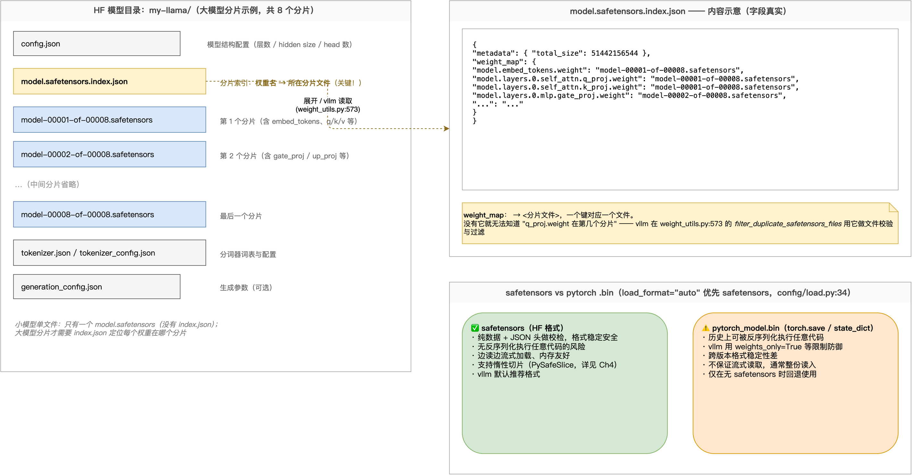

### 名字不是随便起的：它就是模块树的路径

先建立一个整体印象：**模型代码是一层套一层的子模块，checkpoint 里的每个键名，就是这个参数在这棵模块树上的路径**——点号分开的每一段，就是往下走的一级。这些键名不是 vLLM 发明的，就是 PyTorch `state_dict()` / `named_parameters()` 的输出。

树的根是模型类（Llama 是 `LlamaForCausalLM`，Qwen3 MoE 是 `Qwen3MoeForCausalLM`）。它下面挂着两个平级子模块，各管一件事：

- **`model`：模型主体**。几十层 transformer 的骨架全在这里面，占了权重的绝大部分；
- **`lm_head`：输出头**（lm = language model）。模型算到最后会产出一个隐藏向量，`lm_head` 负责把它换算成词表上每个词的得分——模型「下一个词选谁」就看这个得分。

拿真实的键 `model.layers.0.self_attn.q_proj.weight`，从根往下逐段读，每段对应一层子模块：

```text
model        模型主体（对应 Qwen3Model / LlamaModel）
 .layers     ModuleList 容器
 .0          第 0 层 decoder layer（下标）
 .self_attn  attention 子模块
 .q_proj     一个线性层
 .weight     该层的权重参数
```

所以看到一个权重名，就能倒着在模型代码里找到它的落点——这也是排障的基本功：**拿报错里的名字，去 `named_parameters()` 的输出里对**。

`lm_head` 还有一个会直接影响「磁盘上有什么」的特性。它和输入端的 `embed_tokens`（把词查成向量的那张表）形状完全一样，都是「词表 × 隐藏维度」；有些模型干脆让这两块**共用同一份权重**，这就是 **tie**（绑定，配置项 `tie_word_embeddings`）。不 tie 的模型（如 Qwen3-30B-A3B、Qwen2.5-7B、Llama-3.1-8B）磁盘上有独立的 `lm_head.weight` 这条键；tie 了 embedding 的模型（如 Qwen3-4B，`tie_word_embeddings: true`）磁盘上不写这条键，vLLM 加载时让 `lm_head` 与 `embed_tokens` 共享同一块显存。

### 关键差别：vLLM 的参数名 ≠ checkpoint 名

同一个语义的权重，两边名字不一样：

| checkpoint 里（HF 存储）                     | vLLM 模型里（运行时）                         |
| --------------------------------------- | ------------------------------------- |
| `...self_attn.q_proj.weight`（与 k、v 分开存） | 融合进 `...self_attn.qkv_proj` 的 **q 段** |
| `...mlp.gate_proj.weight`（与 up 分开存）     | 融合进 `...mlp.gate_up_proj` 的第 **0** 段  |

HF 按「训练/易读」分着存，vLLM 按「推理吞吐」融合存（一次大矩阵乘同时出 QKV，省 kernel、打满带宽）。这层翻译就是第 1 节三动作里的**翻译**——由谁做、怎么做，到第 6 节揭晓。

### 模块地图

| 组件                                      | 一句话职责                             | 位置                                                          |
| --------------------------------------- | --------------------------------- | ----------------------------------------------------------- |
| `filter_duplicate_safetensors_files`    | 按 index 的 weight_map 校验缺文件、过滤多余分片 | `vllm/vllm/model_executor/model_loader/weight_utils.py:573` |
| `filter_files_not_needed_for_inference` | 黑名单剔除 optimizer 等训练产物             | `vllm/vllm/model_executor/model_loader/weight_utils.py:602` |

### 开发者视角

- 排查任何加载问题的第一步都是「先看磁盘上有什么」：`ls` 目录确认分片齐全，读 index.json 确认那个报错的 key 到底存不存在——很多「名字不认识」类报错在这一步就能分清是文件缺失还是命名不匹配。
- `config.json` 的 `architectures` 字段（如 `Qwen3MoeForCausalLM`）决定 vLLM 选哪个模型类来建骨架；模型选错，后面所有名字都对不上。

---

## 第 3 节 · 两个并行在切什么：TP 与 EP 直觉

> **一句话定义：TP 把一个权重矩阵沿维度切成 N 份（N = TP 卡数），每卡拿一段；EP 把 MoE 的专家按个数分给各卡，每卡完整持有几个专家——前者切「矩阵」，后者切「个数」。**

第 2 节看到磁盘上是一份**完整**的权重；第 1 节说「切分」是加载三动作之一，但没说切的对象到底是什么。读完本节，你应该能徒手画出这两种切法；至于代码里怎么把每卡的那一段切出来、每个专家分到哪张卡，留到第 7、8 节 再看。

### TP：一个矩阵，两种基本切法

一个全连接层就是 `Y = X·Wᵀ`，PyTorch 把 `W` 存成 `[out, in]` 的二维矩阵。TP 对这块矩阵只有两种基本切法：

**Column 切分：切输出维（out）。** 把 W 沿输出维切成 N 段，每卡拿一段，形状是 `[out/N, in]`；输入 X 不切，每卡拿完整的。前向时各卡独立计算，但算出的只是 Y 的一段——把 N 张卡的输出沿输出维**拼接**起来，才是完整的 Y。一句话记：每卡「管一段输出」。

**Row 切分：切输入维（in）。** 把 W 沿输入维切成 N 段，每卡拿一段，形状是 `[out, in/N]`；注意输入 X 也要切成同样的 N 段，每卡拿自己那段。这时每卡算出的**不是 Y 的一段**，而是一个形状和 Y 一样、但只包含一部分贡献的结果（**部分和**）——把 N 张卡的部分和**相加**，才是完整的 Y。一句话记：每卡「贡献一部分求和」。

两种切法的差别就在「X 和 Y 谁被拆开」：Column 是 X 完整、Y 被拆成段（拼回来）；Row 是 X 被拆开、每卡输出的形状和完整 Y 一样、但只是一份贡献（加回来）。

| 切法     | 切哪个维      | 每卡拿到             | 输出怎么变完整     | 对应组件                                                                    |
| ------ | --------- | ---------------- | ----------- | ----------------------------------------------------------------------- |
| Column | 输出维 `out` | `[out/N, in]` 一段 | 各段输出拼回完整    | `ColumnParallelLinear`（`vllm/vllm/model_executor/layers/linear.py:401`） |
| Row    | 输入维 `in`  | `[out, in/N]` 一段 | 各卡部分和相加（归约） | `RowParallelLinear`（`vllm/vllm/model_executor/layers/linear.py:1504`）   |

Column 切分还有个现实动机——**融合层用的就是它**。第 2 节的对照表已经见过：vLLM 把 q、k、v 三个投影融合成一个大 `qkv_proj`，把 gate、up 融合成 `gate_up_proj`。融合出来的大矩阵怎么分给各卡？就按 Column 切：q、k、v 各占 `qkv_proj` 输出维里的一段，gate、up 各占 `gate_up_proj` 的一段（为什么融合偏偏配 Column、Row 又用在什么场景，第 7 节展开）。

**本节到此只给直觉**：column 前向怎么配 all-gather、row 怎么配 all-reduce、column-row 为什么成对出现（每层两次归约）——这些到第 7 节展开。

### EP：切的是专家「个数」，不是矩阵维度

MoE 层里有一批并列的专家（每个专家是一组 FFN 权重），router 为每个 token 挑几个专家来算。EP 的切分对象不是某个矩阵的维度，而是**专家的个数**：8 个专家 ÷ 4 张卡，每卡**完整持有** 2 个专家——专家矩阵本身不切。卡 0 拿 E0/E1，卡 1 拿 E2/E3，依此类推。

代价是：token 要访问的专家可能在别的卡上，需要 all2all 通信把 token 发过去、算完再收回来。

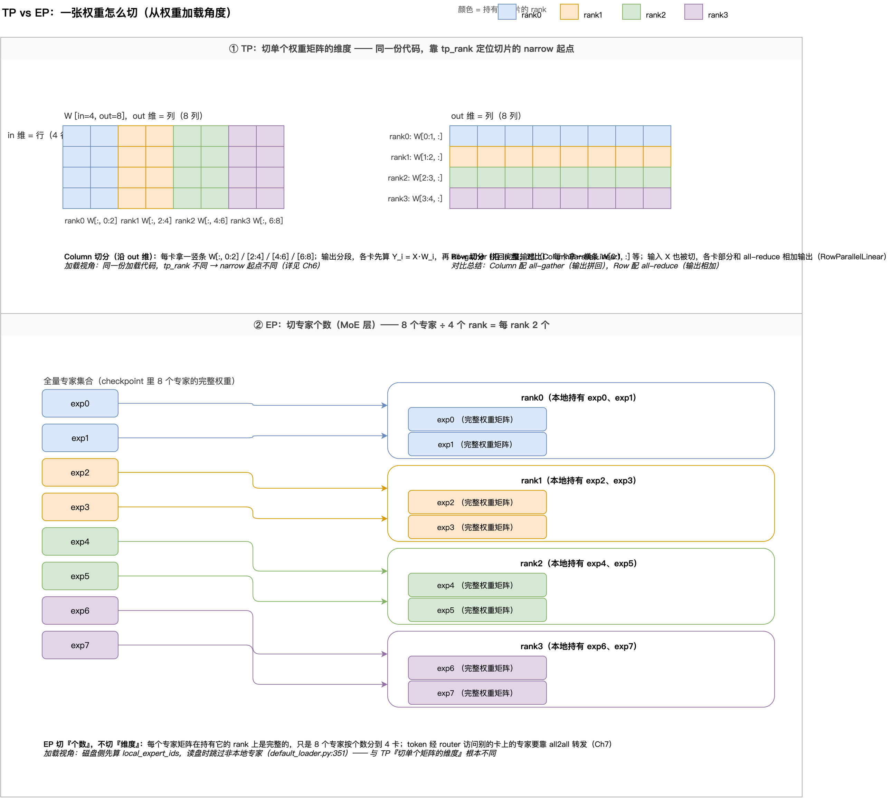

一句话记住根本区别：**TP 切的是单个张量的维度，EP 切的是一批张量的个数。**

### 加载视角：同一份代码，靠 rank 各取所需

这是本节最核心的一点：**不管 TP 还是 EP，所有 rank 跑的是同一份加载代码**——同一个 loader、同一个模型 `load_weights`。不存在「按 rank 分发权重的中央服务器」；每张卡拿到什么，差异全部来自各自读到的卡号（rank）不同：

- **TP 下**：`tp_rank` 不同 → 从同一份权重矩阵的不同位置切走自己那一段；
- **EP 下**：`ep_rank` 不同 → 分到的专家集合不同，每卡只加载分给它的专家——读盘前就算好本地专家清单，其余专家直接跳过不读（第 5 节展开）。

这个卡号也不是加载时才现查的：参数对象创建时就把 `tp_rank`/`tp_size` 刻进了自己身上（`vllm/vllm/model_executor/parameter.py:65-66`，`BasevLLMParameter.__init__`）——每个参数自带卡号。

|        | TP                          | EP                  |
| ------ | --------------------------- | ------------------- |
| 切分对象   | 单个权重矩阵的**维度**               | 一批专家的**个数**         |
| 每卡拿到   | 矩阵的一段切片                     | 完整的几个专家（矩阵不切）       |
| 卡号决定什么 | `tp_rank` → 从矩阵哪个位置切        | `ep_rank` → 分到哪几个专家 |
| 前向通信   | all-gather / all-reduce（第 7 节） | all2all         |

### EP 的开关：只有一个布尔量

用户可配置的只有一个布尔开关 `--enable-expert-parallel`。**EP 组大小不是独立配置项**，而是由部署拓扑推导（常规部署下就等于 TP size）。防坑提醒：vLLM 里不存在 `expert_parallel_size` 这个启动参数，任何这么写的脚本或文档都是错的。

### 开发者视角

- 看到 TP/EP 先问一句「切的是维度还是个数」：维度的问题盯 shape 与切片位置，个数的问题盯专家 ID 集合——两条排障路线完全不同。
- 排障经验：shape 类加载错误九成出在切分假设上（实际卡数、专家数与代码假定的切分对不上）——第 11 节排障一节会回到这句话。
- 想改 EP 组大小，动的是 TP/DP 等部署参数；不要去找一个不存在的 `expert_parallel_size`。

---

## 第 4 节 · 入口：load_format 怎么选 loader

> **一句话定义：load_format 经一张可注册的分发表选出 loader；被选中的 loader 在 `BaseModelLoader.load_model` 的核心四步里完成整个加载。**

基本概念的科普到此为止：磁盘上存的是什么、要切什么，到这里都已经有了直觉。从本节起进入实现的部分——第一站是入口：用户的一句 `load_format`，怎么变成一个真正干活的 loader。

### 用户侧：两种写法，殊途同归

```python
LLM(
 model="Qwen/Qwen3-30B-A3B",
 load_format="safetensors",
 tensor_parallel_size=4
)  # 编程式

vllm serve Qwen/Qwen3-30B-A3B \
 --load-format safetensors \
 --tensor-parallel-size 4    # 命令行
```

两种写法最终都收进 `LoadConfig`（`vllm/vllm/config/load.py:27`），随 `VllmConfig` 一路传到每个 worker 进程。本节只需要它的一个字段：`load_format`（`load.py:30`，默认 `"auto"`）；另一个字段 `model_loader_extra_config`（`load.py:93`）是给 loader 透传额外配置的口子，下游不同 loader 会用到。注意 `load_format` 在 config 层只做小写化、不校验合法取值——哪些值合法，由下面这张分发表说了算。

### 分发表：从 load_format 到 loader 实例

真正的动作发生在 worker 侧：`ModelRunner.load_model`（`vllm/vllm/v1/worker/gpu/model_runner.py:350`）是权重加载的第一个落地动作，核心就两行——选择实际执行的 `model_loader` 类、然后调用这个 `model_loader` 实例：

```python
model_loader = get_model_loader(self.vllm_config.load_config)  # 按 load_format 选 loader
self.model = model_loader.load_model(...)                      # 把控制权交给 loader
```

`get_model_loader`（`vllm/vllm/model_executor/model_loader/__init__.py:119`）做一次字典查找加一次实例化：查 `_LOAD_FORMAT_TO_MODEL_LOADER`（`__init__.py:48`）拿到类，用 `load_config` 当场 new 出实例，查不到直接 `ValueError`。这张表有两点值得记住：

**第一点：八个格式共用同一个 DefaultModelLoader。** `auto / hf / fastsafetensors / instanttensor / mistral / npcache / pt / safetensors` 全都指向它——这些格式的差别只在「读盘方式」，加载流程完全一样，进到 loader 内部再按 `load_format` 分支展开。只有 `dummy`（不读盘、随机权重）、`modelexpress`、`runai_streamer` 系列、`sharded_state`、`tensorizer` 等特殊来源才有各自的类。

**第二点：register_model_loader 是第三方挂载点。** 它是装饰器工厂（`__init__.py:66`）：写一个 `BaseModelLoader` 子类、加上 `@register_model_loader("xxx")`，`--load-format xxx` 就能选中它（强制校验必须是子类，同名注册会覆盖并告警）。vllm-ascend 的 rfork（装饰器行 `vllm-ascend/vllm_ascend/model_loader/rfork/rfork_loader.py:229`）和 netloader（装饰器行 `vllm-ascend/vllm_ascend/model_loader/netloader/netloader.py:79`）正是这样挂进来的。想自己加一个 load_format，就是「实现子类 + 装饰器注册」这两步。

### load_model 的核心四步

loader 选出来之后，跑的是写死在基类里的 `load_model`（`vllm/vllm/model_executor/model_loader/base_loader.py:43`）。注意它**不是抽象方法**，所有 loader 共用、无需重写；真正要求各 loader 自己实现的只有 `download_model` 与 `load_weights` 两个抽象方法。下面介绍一下 load_model 里做了四件事：

1. **`initialize_model`**——按 `config.json` 的 `architectures` 选出模型类，实例化一个**空模型**：先搭骨架、后填数据。默认情况下，模型的权重参数（那些 `*.weight` 张量）在这一步就直接分配到目标设备上了——形状已定、显存已占，但值还是空的，要等第二步把 checkpoint 的数据装进来。
2. **`self.load_weights(model, model_config)`**——真正干活的加载步骤，由每个 loader 自己实现：`DefaultModelLoader` 从磁盘读权重，`DummyModelLoader` 填随机数。读盘、翻译名字、切分、写入参数都发生在这一个调用里。
3. **在线量化收尾**——只有模型里存在「边加载边量化」的模块时才做（判断函数 `_has_online_quant`，`base_loader.py:95`），普通模型直接跳过。
4. **`process_weights_after_loading`**（`vllm/vllm/model_executor/model_loader/utils.py:96`）——逐层收尾：量化权重的重打包、注意力层的延迟初始化等。

四步的分工很清楚：`load_model` 本身只负责把流程串起来，不读盘、不切分、不碰张量数值；真正读盘、装权重的只有第二步；第三、四步是对已经装进来的权重做收尾。而第二步是抽象方法，由选中的 loader 自己实现——所以换一个 `load_format`，换掉的只是这一步的行为，整个流程不变。

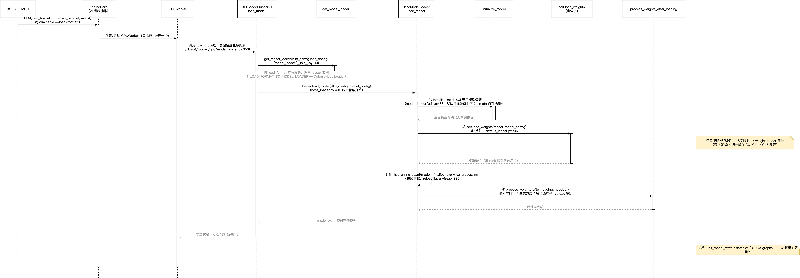

### 模块地图

| 组件 | 一句话职责 | 位置 |
|---|---|---|
| `ModelRunner.load_model` | worker 侧的加载入口：选出 loader，把控制权交给它 | `vllm/vllm/v1/worker/gpu/model_runner.py:350` |
| `LoadConfig` | 存放 `load_format` 等加载配置（默认 `auto`） | `vllm/vllm/config/load.py:27` |
| `_LOAD_FORMAT_TO_MODEL_LOADER` | 分发表：load_format 字符串 → loader 类 | `vllm/vllm/model_executor/model_loader/__init__.py:48` |
| `register_model_loader` | 第三方挂载点：装饰器注册自定义 loader | `vllm/vllm/model_executor/model_loader/__init__.py:66` |
| `get_model_loader` | 查表并实例化；格式不合法直接 raise | `vllm/vllm/model_executor/model_loader/__init__.py:119` |
| `BaseModelLoader.load_model` | 核心四步：只串流程，自己不干活 | `vllm/vllm/model_executor/model_loader/base_loader.py:43` |
| `initialize_model` | 建空模型：先搭骨架、后填数据 | `vllm/vllm/model_executor/model_loader/utils.py:37` |

### 开发者视角

- 排障先定位「问题出在第几步」：看日志停在哪——还没走到 `Loading weights on ...` 打点（`base_loader.py:63`，位于第一步与第二步之间）是第一步建模型的问题（config/模型类），停在这句之后是第二步装权重的问题（读盘/名字/切分），最后才是第四步后处理（量化重打包）。
- 想让内部工具链用上自定义权重来源（对象存储、别的实例……），不必改 vLLM 主干：实现 `BaseModelLoader` 子类注册进来即可，rfork/netloader 就是现成范例。

---

## 第 5 节 · 读盘：惰性迭代器与 EP 过滤

> **一句话定义：DefaultModelLoader 把磁盘上的权重变成一条 `(name, tensor)` 的惰性流，边读边交给模型，任意时刻内存里只有「正在处理的这一个权重」；EP 模式更进一步，在读盘之前就跳过非本地的专家。**

上一节讲的 `load_model` 里的核心四步中的第二步 `load_weights`——真正干活的加载步骤。本节讲它的读取侧：磁盘上的权重怎么被读出来、为什么这种读法内存友好、EP 又是怎么在读盘发生之前就把 IO 省掉的。

### 权重流怎么来：一行代码

读取磁盘的操作发生在 `DefaultModelLoader`（`vllm/vllm/model_executor/model_loader/default_loader.py:43`）——主干是 `load_weights` 里的这一行：

```python
loaded_weights = model.load_weights(self.get_all_weights(model_config, model))
```

`get_all_weights` 把 checkpoint 里的全部权重变成一个迭代器，后面逐条产出 `(name, tensor)`（个别模型还会额外声明自己附属的权重来源 `secondary_weights`，默认为空，可以先不管）。上面这行把整条迭代器整个交给模型侧——loader 自己不逐条处理，只负责把流交出去。

### 惰性迭代器：`(name, tensor)` 一条条产出

读 safetensors 文件且未启用多线程或专用库时，走的就是默认路径 `safetensors_weights_iterator`（`vllm/vllm/model_executor/model_loader/weight_utils.py:829`）；npcache/pt 等其余格式各有专用迭代器，机制同构，不展开。

主循环（lazy 分支）：

```python
with safe_open(st_file, framework="pt") as f:
    for name in f.keys():                        # 只读文件头/元数据，不读数据
        if should_skip_weight(name, local_expert_ids):
            continue                             # EP：读盘前过滤（见下）
        param = f.get_tensor(name)               # 返回 PySafeSlice 惰性切片
        yield name, param
```

这段代码的省内存是三层递进的：

**第一层，打开文件只读文件头。** `safe_open` 的成本只是读一段元数据（有哪些名字、什么 shape、每个张量的数据在文件的哪个位置），张量数据本身还留在磁盘上。

**第二层，`yield` 让权重一次只过一条。** 生成器不会把几百个权重同时放进内存——模型侧处理完一条，才轮到下一条，任意时刻流水线上只有一条。

**第三层，`f.get_tensor(name)` 返回切片（PySafeSlice），连这一条的数据都先不读。** 数据等到真正要用的时候才从磁盘上读出来（`convert_pyslice_to_tensor`，`weight_utils.py:1207`）；在那之前还可以先在切片上把要的那一段圈出来，读盘时只读这一段——TP 下每卡只需要矩阵的 1/N，就只读 1/N。

和普通做法对比一下收益：普通做法是先把整份 checkpoint 读进内存组成 state_dict，再装进模型，几十上百 GB 的模型要同时占「checkpoint 副本 + 模型参数」两份内存；vLLM 这种读法是生成器逐条产出，**任意时刻内存里只有「正在处理的这一个权重 + 已经建好的模型参数」**，不存在整份 checkpoint 的内存副本。

读盘策略由 `safetensors_load_strategy` 控制，取值三个：`lazy` 按需读，是默认值（网络盘且内存够时，默认会自动转成预取，第 9 节讲）；`eager` 把整个文件一次读进**进程内存**再产出，适合网络磁盘上减少随机读，代价是进程内存里多一份 checkpoint 副本；`prefetch` 只把文件提前顺序读一遍，数据留在 OS page cache——page cache 是**操作系统在主内存里缓存磁盘文件内容的区域**，数据进了内存但属内核管理、不占本进程内存，之后按需读时直接命中缓存，进程内存不涨，第 9 节展开。

### EP 读盘过滤：非本地专家在读盘前就被跳过

EP 有一个独立的读盘过滤环节：`load_weights` 会先调 `_init_ep_weight_filter`（`default_loader.py:351`）算出本 rank 的 `local_expert_ids`——由 `compute_local_expert_ids`（`vllm/vllm/model_executor/model_loader/ep_weight_filter.py:31`）按 EP 组大小把专家分给各 rank。到了主循环，**每个 key 先过 `should_skip_weight`（`ep_weight_filter.py:64`）、再 `f.get_tensor`**——非本地专家的名字直接 continue，不会向磁盘发起这段数据的读请求。

这层过滤的收益很大：专家权重占 MoE 模型总权重的 85~90%（`ep_weight_filter.py:7-8`）。不过滤的话，非本地专家也会被读进内存、再在模型侧丢弃，白白浪费 IO 和内存；过滤之后，**专家部分的读盘量变成原来的 1/ep_size**。注意省的是读盘 IO 和内存峰值，不是 GPU/NPU 显存——显存本来就只放本地专家。

两个补充：`should_skip_weight` 只跳过 `.weight`/`.weight_packed` 结尾的大张量，scale 这类小张量保留——部分量化后端的 kernel 按全局专家编号组织 scale，需要完整的 scale 集合在场，而 scale 体积很小，保留成本可以忽略；过滤生效的前提是模型为 MoE、开了 `--enable-expert-parallel`、且显式打开 `--enable-ep-weight-filter`（默认关闭）。

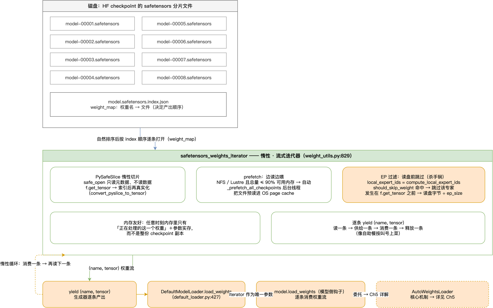

### 模块地图

| 组件 | 一句话职责 | 位置 |
|---|---|---|
| `DefaultModelLoader.load_weights` | 先算 EP 过滤集合，再用一行代码把迭代器交给模型，最后严格校验 | `vllm/vllm/model_executor/model_loader/default_loader.py:415` |
| `get_all_weights` | 把主权重源和 secondary_weights 拼成总迭代器 | `vllm/vllm/model_executor/model_loader/default_loader.py:321` |
| `safetensors_weights_iterator` | 默认读盘路径：逐张量按需产出 + EP 读盘前过滤 | `vllm/vllm/model_executor/model_loader/weight_utils.py:829` |
| `convert_pyslice_to_tensor` | PySafeSlice → 真实张量，真正要用数据时才读盘 | `vllm/vllm/model_executor/model_loader/weight_utils.py:1207` |
| `_init_ep_weight_filter` | 算出本 rank 的 local_expert_ids | `vllm/vllm/model_executor/model_loader/default_loader.py:351` |
| `compute_local_expert_ids` | 专家 id 划分：linear 连续 / round_robin 交错 | `vllm/vllm/model_executor/model_loader/ep_weight_filter.py:31` |
| `should_skip_weight` | 读盘前判定：非本地专家 → 跳过 | `vllm/vllm/model_executor/model_loader/ep_weight_filter.py:64` |

### 开发者视角

- 加载慢先分清「读盘慢还是写入慢」：总耗时日志 `Loading weights took X seconds`（`default_loader.py:430`）覆盖的是读盘加写入的整段——慢在读盘，用第 9 节的提速手段（prefetch/预热）；慢在写入，多半是 TP/EP 切分与回写的问题。
- 过滤生效时日志会打 `EP weight filter: ep_size=..., ep_rank=..., loading X/Y experts`，看到这行就知道过滤在工作。
- 装完之后有一道严格校验 `track_weights_loading`（`default_loader.py:447`）：模型参数与已加载权重做差集，非空直接报 `Following weights were not initialized from checkpoint`——非量化模型默认开启，报错细节与排查见第 11 节。

---

## 第 6 节 · 核心机制：WeightsMapper 与 AutoWeightsLoader

> **一句话定义：WeightsMapper 声明「checkpoint 名字怎么翻译成 vLLM 参数名」，AutoWeightsLoader 顺着模型树递归把权重逐个装进参数；有了这两个机制，模型侧的加载代码从几百行手写循环变成几行声明。**

第 5 节讲到模型侧拿到一条 `(name, tensor)` 惰性流为止。这一节讲模型侧 `load_weights` 的两个核心角色：一个负责翻译名字（WeightsMapper），一个负责顺着模型树把权重写进参数（AutoWeightsLoader）。本节最后会跟着一条真实的权重把整个流程走一遍。

### WeightsMapper：一本改名词典

`WeightsMapper`（`vllm/vllm/model_executor/models/utils.py:46`）就是这本词典：一个 `@dataclass`，声明「checkpoint 的名字怎么改写成 vLLM 的名字」。查表规则按匹配方式分成几类——正则、子串、前缀、后缀，另有一类对接 HF 官方的改名协议——这些都是单纯的改名，本节不逐个展开。真正要展开的是特殊的一类：**融合规则 `orig_to_new_stacked`**。普通规则只改名；融合规则除了改名还带一个 `shard_id`——因为一个融合参数要接收好几条 checkpoint 权重（`qkv_proj` 要接收 q、k、v 各一条），光把名字都改成 `.qkv_proj` 还不够，还得说清「这条数据放进融合矩阵的第几段」，`shard_id` 就是这个段号。

演示模型 Qwen3-30B-A3B（`Qwen3MoeForCausalLM`）声明的融合规则（`vllm/vllm/model_executor/models/qwen3_moe.py:427`）：

```python
hf_to_vllm_mapper = WeightsMapper(
        orig_to_new_stacked={
            # weight_name: (param_name, shard_id)
            ".q_proj": (".qkv_proj", "q"),
            ".k_proj": (".qkv_proj", "k"),
            ".v_proj": (".qkv_proj", "v"),
            # .experts.gate_up_proj must be handled by MoERunner.load_weights for EP
            ".mlp.gate_proj": (".mlp.gate_up_proj", 0),
            ".mlp.up_proj": (".mlp.gate_up_proj", 1),
            ".shared_expert.gate_proj": (".shared_expert.gate_up_proj", 0),
            ".shared_expert.up_proj": (".shared_expert.gate_up_proj", 1),
        }
    )
```

对着代码从上往下看：q、k、v 三条把 attention 的三个投影归到 `qkv_proj` 名下；`.mlp.gate_proj`/`.mlp.up_proj` 两条是 dense MLP 层的融合规则——30B 模型每层都是 MoE、磁盘上没有这两个键，这两条在本模型上不会触发；最后两条是 shared_expert（每层共享、每个 token 都参与的专家）的 gate/up 融合。

**shard_id 怎么传到最深层——答案是把属性挂在张量上。** mapper 的执行入口 `apply`（`models/utils.py:136`）对每条权重查表改名，随后一行 `data.shard_id = shard_id`（`models/utils.py:145`）：Python 允许在张量实例上临时挂任意属性，`shard_id` 就这样跟着权重张量一路传下去、穿过中间每一层递归，最后由最深处的融合线性层用 `getattr(loaded_weight, "shard_id", None)` 取出。不用额外传参、也不建全局表，「放进哪一段」的信息就能原封不动地传到叶子参数。

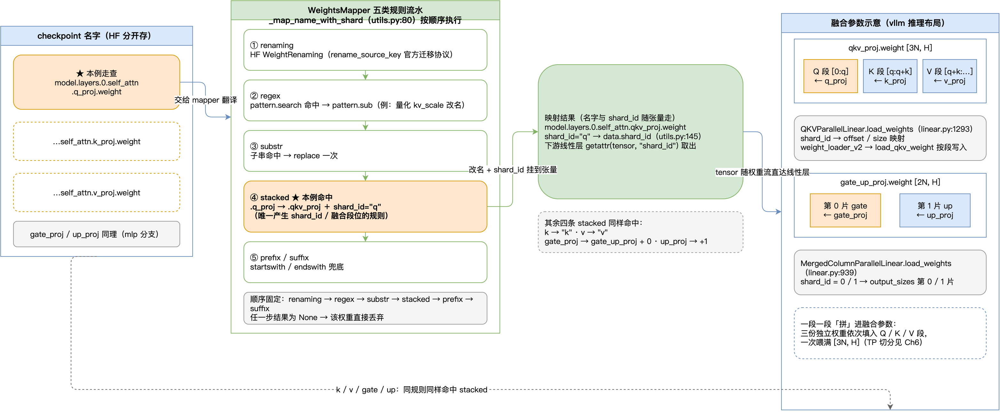

### AutoWeightsLoader：照着名字逐段下钻

名字翻译好了，写入交给 `AutoWeightsLoader`（`vllm/vllm/model_executor/models/utils.py:172`）。它要解决的问题一句话就能说清：模型侧有一堆 `(名字, 张量)`，要把它们放进一棵模型树——而名字的每一段正好对应树上的一层，`model.layers.0.self_attn.qkv_proj.weight` 从左到右就是从树根走到目标参数的路径。

做法是**照着名字逐段下钻**：每一层看名字的第一段，去当前层的子模块里找——

- 第一段是 `model`，找得到：把所有 `model.` 开头的权重整组交给 `model` 子模块，剥掉这段前缀、继续往下递归；
- 接下来依次是 `layers`、`0`、`self_attn`，一层层交给下去；
- 走到名字只剩最后一段 `weight` 时，它对应的是一个参数：交给参数自己的 `weight_loader` 写入。

核心逻辑就一个函数 `_load_module`（`models/utils.py:316`），下面是去掉日志等细节的骨架，和上面的走例一一对应：

```python
def _load_module(self, base_prefix, module, weights):
    # ① 子模块自己定义了 load_weights？优先调它（模块级钩子，见要点一）
    if module != self.module:
        module_load_weights = getattr(module, "load_weights", None)
        if callable(module_load_weights):
            loaded_params = module_load_weights(weights)
            ...

    child_modules = dict(module.named_children())                 # 这层的子模块
    child_params = dict(module.named_parameters(recurse=False))   # 这层直属的参数

    # ② 按名字首段分组，三路派发
    for child_prefix, child_weights in self._groupby_prefix(weights):
        if child_prefix in child_modules:      # 第一段是子模块 → 递归下钻（走例里的 model/layers/…）
            yield from self._load_module(...)
        elif child_prefix in child_params:     # 第一段是参数 → 交给参数的 weight_loader（走例里最后的 weight）
            yield from self._load_param(...)
        else:                                  # 都不认识 → 查 skip/ignore 名单，再没有就 raise
            ...
```

两条补充。命中参数时，谁来执行写入取决于参数的类型：模型里默认的 `nn.Parameter` 是个裸张量、没有任何加载逻辑，落到 `default_weight_loader`（`weight_utils.py:1222`）做形状校验后全量复制；vLLM 给并行层把参数换成了子类 `BasevLLMParameter`（继承自 `nn.Parameter`，`parameter.py:32`），自带 `weight_loader` 回调——TP/EP 的切分逻辑就写在这个回调里。都不认识时，按 skip/ignore 名单放行，不在名单里就直接 raise。

**要点一：模块级钩子（代码 ① 处）。** 下钻之前先问一句：这个子模块自己定义了 `load_weights` 吗？定义了就整组交给它、不再逐段下钻。演示模型的嵌套正好是两层钩子的组合：

```python
# 外层 Qwen3MoeForCausalLM.load_weights（qwen3_moe.py:648）——就两行
def load_weights(self, weights):
    loader = AutoWeightsLoader(self)
    return loader.load_weights(weights)          # 没传 mapper：改名在下一层才发生

# 下钻到 self.model 时命中的钩子 Qwen3MoeModel.load_weights（qwen3_moe.py:519）
def load_weights(self, weights):
    loader = AutoWeightsLoader(self, ignore_unexpected_suffixes=[".bias", ...])
    return loader.load_weights(weights, mapper=self.hf_to_vllm_mapper)  # 这一层传入改名词典
```

外层递归下钻到 `self.model` 时，代码 ① 处发现 `Qwen3MoeModel` 自带 `load_weights`，整个内层都交给它——它又 new 一个 loader 对内部继续递归，同一套机制每一层复用。

**要点二：每个权重只被处理一次。** `for child_prefix, child_weights in self._groupby_prefix(weights)` 这一行把权重流按名字首段**连续分组**（`_groupby_prefix`，`models/utils.py:216`）、逐组交给唯一的去向，分组用一次就丢——整条流走下来每条权重恰好进一个叶子。这依赖一个前提：同前缀的名字在流里是连续的——safetensors 迭代器按 key 字典序产出，天然满足。

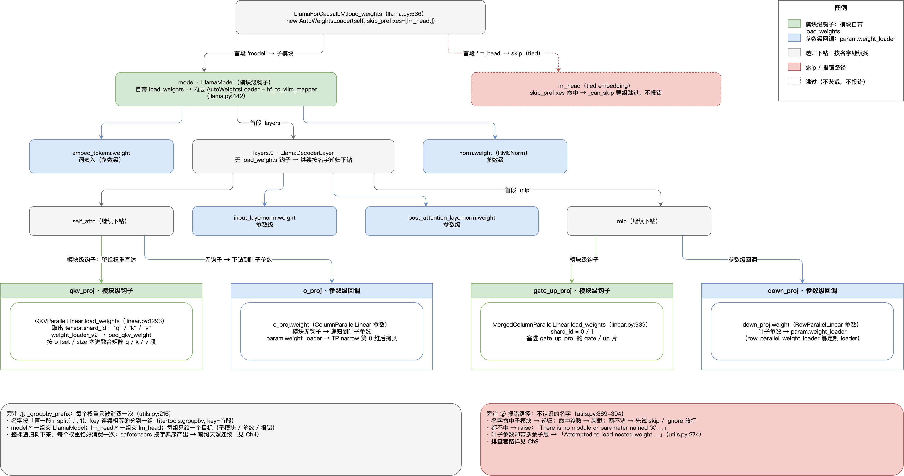

### 跟一条权重走全程

举一个例子来跟踪一下一个权重模块的加载流程，假设我们要处理的：`model.layers.0.self_attn.q_proj.weight`：

| 步   | 发生什么                                                                                        | 位置                                       |
| --- | ------------------------------------------------------------------------------------------- | ---------------------------------------- |
| 1   | 迭代器 yield `(…q_proj.weight, tensor)`，进入 `Qwen3MoeForCausalLM.load_weights` 开始递归             | `qwen3_moe.py:648`                       |
| 2   | 下探命中 `Qwen3MoeModel.load_weights` 钩子，mapper 生效：`.q_proj` 改名 `.qkv_proj`，`shard_id="q"` 挂上张量 | `qwen3_moe.py:519`、`models/utils.py:145` |
| 3   | 沿 `model → layers → 0 → self_attn → qkv_proj` 按首段递归，名字一段段被拆掉                                | `models/utils.py:316`                    |
| 4   | 到达 `qkv_proj` 子模块，命中模块级钩子，组内名字只剩末段 `weight`                                                 | `linear.py:1293`                         |
| 5   | 钩子取出 `shard_id="q"`，把数据塞进融合矩阵的 Q 段                                       | `linear.py:1054,1064`                    |
| 6   | 装好的参数名逐层 yield 回传，汇成「实际装了哪些参数」的集合                                                           | `models/utils.py:397`                    |

### 三条补充

**skip 与 ignore——两种合法的「不装」。**

- **skip：名单上明确不要的。** 两类典型：tie 了 embedding 的 `lm_head.` 前缀——它和 embed_tokens 共享显存，装一份就够了；`rotary_emb.inv_freq` 这类训练残留——vLLM 根本用不到。默认名单在 `models/utils.py:190`。
- **ignore：意料之外出现、宽容放过的。** 它管的是「盘上有、但 vLLM 模型里没有对应参数」的键——不宽容的话，加载在这里直接报错。最高频的是 `.bias`：GPTQ 等量化工具导出的 checkpoint 常带 bias 条目，而模型侧没有对应的 bias 参数，装载入口因此默认把 `.bias` 后缀追加进 ignore（`models/utils.py:404`，代码注释原话 "typically from GPTQ models"）。演示模型也声明了自己的名单（`.bias`、`_bias`、`.weight_scale` 等，`qwen3_moe.py:522-529`）。

一句话区分：skip 是「我知道我不要」，ignore 是「没想到会有，但也算了」。

**装完对账——漏装必报。** 走全程最后返回的「实际装了哪些参数」集合，loader 拿它与模型全部 `named_parameters` 做差集（`track_weights_loading`，`default_loader.py:447`），有漏的直接 raise `Following weights were not initialized from checkpoint`（`default_loader.py:468`）。「多了」在递归中当场报，「少了」在这里兜底报；这道校验默认只对非量化模型开启。

**新旧机制——几行声明与几百行手写。** 没有这套机制时，每个模型都得手写几百行装载循环，`deepseek_v2` 至今保留着这个写法（`deepseek_v2.py:1513`）——它的 MLA（多头潜在注意力）融合结构和专家映射表定制太强，通用递归覆盖不了；有了这套机制，主流模型收敛成几行声明（演示模型：七条映射 + 几行调用）。两代写法靠模块级钩子共存：deepseek 外层也用 AutoWeightsLoader（`deepseek_v2.py:1918`），下钻到 `DeepseekV2Model` 时交回手写循环。

### 模块地图

| 组件 | 一句话职责 | 位置 |
|---|---|---|
| `WeightsMapper` | 改名词典：声明「checkpoint 名 → vLLM 参数名」，融合规则额外携带 shard_id；执行入口 `apply` 负责改名并把 shard_id 挂到张量上 | `vllm/vllm/model_executor/models/utils.py:46,136` |
| `AutoWeightsLoader` | 递归装载：照名字首段派发（子模块/参数/名单），支持模块级钩子 | `vllm/vllm/model_executor/models/utils.py:172` |
| `default_weight_loader` | 裸参数的兜底写入：形状校验后全量复制 | `vllm/vllm/model_executor/model_loader/weight_utils.py:1222` |
| `Qwen3MoeModel` | 演示模型：七条融合映射声明 + load_weights 钩子 | `vllm/vllm/model_executor/models/qwen3_moe.py:427,519` |
| `QKVParallelLinear.load_weights` | 最深处的钩子：读 shard_id、把数据按段写进融合矩阵 | `vllm/vllm/model_executor/layers/linear.py:1293` |

### 开发者视角

- 给模型加一种新命名支持，改的是 mapper 声明而不是装载循环：在 `orig_to_new_*` 里加一条规则即可生效，qwen3 系模型就是这套写法的范本。
- 两个最高频的加载报错就诞生在本节链路上：`There is no module or parameter named ...`（名字两边都对不上，`models/utils.py:389`）与 `Attempted to load nested weight ...`（把带子层的名字塞给单个参数，`models/utils.py:275`）——看到它们就回到「三路派发 + 钩子」的机制里找原因。
- 怀疑权重装错段或被静默丢弃时，设 `VLLM_LOGGING_LEVEL=DEBUG` 能逐条看到每个权重命中 load/skip/ignore 哪条分支。

---

## 第 7 节 · TP 切分与典型计算方式

> **一句话定义：TP 下每个权重的加载都是三段式「读盘 → narrow 出本 rank 切片 → copy 写入参数」；前向计算上，column 切输出维、row 切输入维，一层 Transformer 通常只需 2 次 all-reduce。**

第 6 节讲到了「这段数据塞进融合参数的哪一段」；本节补上最后一问：全量权重从磁盘上读出后，每张卡到底切走哪一部分。先讲加载侧的三段式，再单列前向侧的典型计算方式。

### 三段式：读盘 → narrow → copy

TP 下所有 rank 跑的是**同一份**加载代码，唯一差别是各自的 `tp_rank`。每个权重的加载都是同一个三段式：

1. **读盘**：第 5 节的迭代器给出**全量** `loaded_weight`——完整矩阵，此时还没按 TP 切，而且还在 **CPU 内存**（磁盘读出来的数据先落在内存里）。
2. **narrow 出本 rank 切片**：`narrow` 是 PyTorch 张量的方法，意思就是「沿着某一维、从某个起点取一段」——「切走一段」，落到代码里就是这一个调用。参数的 `weight_loader` 回调执行 `loaded_weight.narrow(dim, tp_rank × shard_size, shard_size)`——沿哪一维切、段长多少由参数自己声明；切片是在内存张量上做的视图、不搬数据；各 rank 的 `tp_rank` 不同、起点不同，N 个切片互不重叠且并起来是全集。
3. **copy 写入**：`param.data.copy_(loaded)` 把切片真正搬进本 rank 参数——`param` 是第 4 节建好的**设备上参数**（形状已定、显存已占、值还是空），`loaded` 是内存里的切片，这一步对每个权重执行一次 **host → device** 搬运；narrow 只是在内存账本上划了个范围，copy 才是把数据真正搬上设备。

**这个卡号从哪来——创建参数时就刻进去。** `BasevLLMParameter`（`vllm/vllm/model_executor/parameter.py:32`）在 `__init__` 里把 `tp_rank / tp_size` 刻进参数自身（`parameter.py:65-66`，取值来自 `vllm/vllm/distributed/parallel_state.py:2068、2073`）。这正是第 3 节「同一份代码、不同 rank」的代码落点：每个参数自带卡号，narrow 公式里只出现 `self.tp_rank`。

**参数家族按「怎么切」归类**：column 系沿输出维 narrow（`parameter.py:148`）、row 系沿输入维 narrow（`:220`）、qkv 融合三段对齐是 column 的特化（`:178`）；v1/v2 两代接口一句带过——v1 把切分写在线性层里，v2 把切分逻辑下沉到参数类的 `load_*` 方法，功能等价、主流路径已走 v2。

### 建参数时就已除好：shape 报错的源头

`ColumnParallelLinear`（`vllm/vllm/model_executor/layers/linear.py:401`）创建权重时就把输出维除好：`output_size_per_partition = divide(output_size, tp_size)`（`linear.py:461`），`divide` 断言整除。于是加载时比对的是「narrow 出的切片 vs **已除好的参数**」，两边形状对不上就是 shape mismatch——第 11 节的 shape 类报错主要来源就在这条线上。

### TP 前向的典型计算方式

加载解决「每卡拿哪一块」，前向解决「拿到以后怎么算」。记全连接层为 `Y = X·Wᵀ`，`W` 存成 `[out, in]`：

**column 层：每卡算输出的一段，需要完整输出时 all-gather 拼回。** 每卡拿完整输入 X 和自己那段 `W_i`（`[out/N, in]`），算出的只是输出的一段；`ColumnParallelLinear.forward` 在 `gather_output=True` 时用 all-gather 把各卡的输出段拼回完整 `Y`（`linear.py:576-582`）。

**row 层：输入已被上一层切好，每卡算部分和，all-reduce 求和。** 每卡拿 X 的一段和自己那段 `W_i`（`[out, in/N]`），算出的只是部分和；`RowParallelLinear.forward` 用 all-reduce 把所有卡的部分和相加得到完整 `Y`（`linear.py:1653-1654`）。

**成对结构：column 的分段输出正好是 row 需要的分段输入，中间不需要通信。** 一层 Transformer 恰好两对：

| 位置 | column（切输出维） | row（切输入维） | 出口通信 |
|---|---|---|---|
| attention | `qkv_proj` | `o_proj` | 1 次 all-reduce |
| MLP | `gate_up_proj` | `down_proj` | 1 次 all-reduce |

**一句话总结：一个 Transformer 层的 TP 前向通常只需 2 次 all-reduce——attention 出口一次、MLP 出口一次。** column 的输出维切分被紧随其后的 row 输入维切分消掉，通信只发生在每个「column→row 对」的出口。

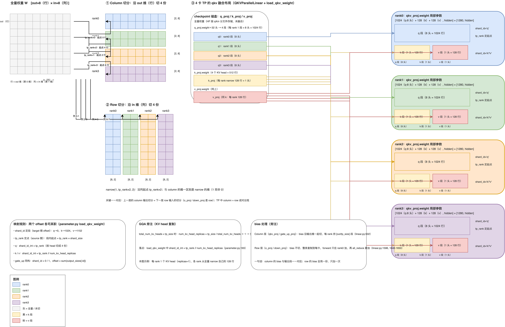

### 模块地图

| 组件 | 一句话职责 | 位置 |
|---|---|---|
| `BasevLLMParameter` | 参数基类：创建时把 tp_rank/tp_size 刻进自身 | `vllm/vllm/model_executor/parameter.py:32,65` |
| `load_column_parallel_weight` | column 切分：沿输出维 narrow 本 rank 段 | `vllm/vllm/model_executor/parameter.py:148` |
| `load_row_parallel_weight` | row 切分：沿输入维 narrow 本 rank 段 | `vllm/vllm/model_executor/parameter.py:220` |
| `ColumnParallelLinear` | 建参数时除好输出维；前向可 all-gather 拼回 | `vllm/vllm/model_executor/layers/linear.py:401,461` |
| `RowParallelLinear` | 输入维已切；前向 all-reduce 求和 | `vllm/vllm/model_executor/layers/linear.py:1504` |

### 开发者视角

- 改 TP 卡数前先做整除检查：拿 config.json 的 `num_attention_heads`、`num_key_value_heads`、`intermediate_size` 对卡数过一遍，不能整除会在建模型阶段就被 `divide` 断言拦下。

---

## 第 8 节 · 量化挂在链路哪里（简述）

> **一句话定义：量化不是加载完成后的黑魔法，而是挂在加载链路上的三个钩子——建模型前解析配置、装权重时 scale 名进 mapper、装完后重打包。**

本节把第 4 节和第 6 节留下的三个量化钩子讲完：load_model 核心四步的第一步提过「在线量化时参数才建在 meta device」、第三四步提过「量化收尾与重打包」，第 6 节的模块地图里写过「合入量化 mapper」。三个挂载点按四步顺序各用一段讲清，只回答「钩子挂在哪、由谁调用」，不展开任何量化算法与 kernel 细节。

### 挂载点 1（建模型前）：解析 quant_config，让配置认识模型

`get_quant_config`（`vllm/vllm/model_executor/model_loader/weight_utils.py:240`）把量化配置解析出来：先读 config.json 里嵌的 `quantization_config` 字段，没有再按量化方法声明的文件名去模型目录里找独立的 json（如 `quant_config.json`）。随后在 `initialize_model` 的最顶端、模型类真正构造之前，`configure_quant_config`（`vllm/vllm/model_executor/model_loader/utils.py:260`）把模型类的融合映射与打包结构传给这份配置——让量化配置认识到「这个模型把 qkv/gate_up 融合着建」，它做「哪些层被量化、HF 名字叫什么」的匹配时才能对得上。这个钩子对应四步里的第一步。

### 挂载点 2（装权重时）：scale 名与普通权重同走一条 mapper

量化 checkpoint 比 bf16 多出一批伴随张量——scale、zero_point 等。它们同样以名字存放在 safetensors 里，也就同样必须走第 6 节的翻译管道才能找到落点。`AutoWeightsLoader.load_weights` 发现自己或直接子模块挂着 quant_config 时（`vllm/vllm/model_executor/models/utils.py:410`），自动把 `quant_config.get_cache_scale_mapper()`——一组正则（`vllm/vllm/model_executor/layers/quantization/base_config.py:195`）——合并进模型自己的 mapper（`:413`），把各家量化工具五花八门的 **KV-cache 类 scale 名**改写成 vLLM 认识的落点（如 `.kv_scale` → `.attn.k_scale`）。

模型用不到的多余 scale 后缀（`.q_scale/.k_scale` 等）则由 ignore 名单放行（`base_config.py:90`）——不认识的 scale 名要么被正则改写、要么被跳过。一句话：**scale 张量名和普通权重名走的是同一条 mapper 管道，量化没有另起一套名字解析机制。** 这个钩子对应四步里的第二步。

### 挂载点 3（装完后）：重打包成 kernel 认识的布局

`process_weights_after_loading`（`vllm/vllm/model_executor/model_loader/utils.py:96`）遍历 `model.named_modules()`，对每个挂着 quant_method 的层调用其后处理，做重打包/转置。原因一句话：**checkpoint 里的紧凑存储格式（int4 打包、FP8 block）不能直接进 kernel，得摆成推理 kernel 认识的布局**——装完之后这一步才把「省空间的存储格式」变成「能算的运行格式」。这个钩子对应四步里的第四步。这一步并非量化专属——注意力层的延迟初始化等模型级后处理同样在此搭车执行。

### 在线量化：参数留在 meta device 上

普通量化与在线量化的分界一句话：**普通量化是先全量装完、再统一重打包；在线量化是参数留在 meta device（只有形状、没有存储）、边加载边量化**——checkpoint 无需预量化，加载时现算。四步里第三步的 `_has_online_quant`（`vllm/vllm/model_executor/model_loader/base_loader.py:95`）扫一遍模块的 `uses_meta_device` 标志判定是否走在线路径，是则多一步 `finalize_layerwise_processing`（`vllm/vllm/model_executor/model_loader/reload/layerwise.py:228`）收尾。两条路径最终都落在四步流程的后处理阶段，差别只在「先全量后处理」还是「逐层就地处理」。

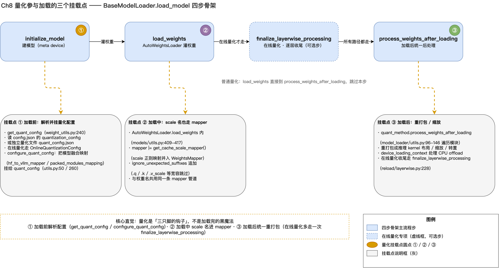

### 模块地图

| 组件 | 一句话职责 | 位置 |
|---|---|---|
| `get_quant_config` | 解析量化配置：config.json 的 `quantization_config` 或独立 json | `vllm/vllm/model_executor/model_loader/weight_utils.py:240` |
| `get_cache_scale_mapper` | scale 名正则映射，合并进模型自己的 mapper | `vllm/vllm/model_executor/layers/quantization/base_config.py:195` |
| `process_weights_after_loading` | 装完后遍历量化层，重打包成 kernel 认识的布局 | `vllm/vllm/model_executor/model_loader/utils.py:96` |

### 开发者视角

- scale 相关的两类报错——checkpoint 里的 scale 名字不被认识（`There is no module or parameter named ...`）、该有的 scale 没装上——排查的第一站都是挂载点 2 的正则表与 ignore 名单：名字不认识说明既没被正则改写、又不在 ignore 名单；该有的 scale 缺失同样先回到这张正则表对名字。细节第 11 节展开。
- 量化模型默认不开「漏装必报」的严格校验（代码落点 `vllm/vllm/model_executor/model_loader/default_loader.py:436`：`model_config.quantization` 非空即默认跳过）——量化模型的漏装别指望差集校验兜底，直接开 DEBUG 日志逐条看 load/skip/ignore 分支（第 11 节展开）。

---

## 第 9 节 · 让加载更快：提速与快速起实例

> **一句话定义：加载提速分三层——让「盘」更快（prefetch 与 page cache 预热）、让「流程」更省（多线程、减层跑）、干脆不读盘（跨实例拿权重，第 10 节）。**

加载链路讲完了，从本节起回答三个实战问题。第一问：加载慢，怎么让它更快。

动手前先定位瓶颈。`Loading weights took X seconds`（`vllm/vllm/model_executor/model_loader/default_loader.py:430`，`logger.info_once` 每进程只打一次）掐的是「读盘 + 写入」的整段时间：读盘慢（IO 等待）该用本节的 prefetch/预热；写入慢（TP/EP 切分与回写）要到第 7 节的路径里找原因。分清这两者，是选对提速手段的前提。（实际上一般都是读盘慢，极少见到写入慢的现象）

### prefetch 策略与 page cache 预热

第 5 节提过「网络盘且内存够时，默认会自动转成预取」，这里讲它的机制。读盘策略由 `safetensors_load_strategy` 字段控制（`vllm/vllm/config/load.py:62`），关键取值：

| 取值 | 行为 |
|---|---|
| `None`（默认） | 按需 lazy 读；网络文件系统（NFS/Lustre）且 checkpoint 总量 ≤ 可用内存 90% 时**自动预取**（`vllm/vllm/model_executor/model_loader/weight_utils.py:850-912`） |
| `"prefetch"` | 显式开启预取，本地盘也生效；总量放不下内存时告警有 OOM 风险 |
| `"lazy"` | 显式锁定按需读，**不做**自动预取 |

预取的实现本质一句话：**提前把文件读进主内存的 page cache**（page cache 是操作系统在主内存里缓存磁盘文件内容的区域，属内核管理、不占进程内存）。`_prefetch_checkpoint`（`weight_utils.py:737`）按块顺序读文件，数据只进内核这份缓存、应用层不留存；`_prefetch_all_checkpoints`（`:754`）把文件按 rank 交错分片（`sorted_files[rank::world_size]`）交给后台线程池，每个文件恰好被一个 rank 读一遍。默认参数：预取线程数 8、块大小 16MiB（字段 `load.py:84/:89`，常量定义 `:12-13`）。预取在后台与写入并行；等加载真正读文件时大多直接命中 page cache，基本不再等慢速磁盘/网络盘的随机读。

**手动预热：不进 vLLM 也能做同一件事。** 既然机制本质是「先把文件读进 page cache」，那么在启动 vLLM **之前**，用一个顺序读把盘过一遍就能达到同样效果：

```bash
cat model*.safetensors > /dev/null   # 顺序读一遍；dd 等价
```

第二次启动命中缓存，加载明显变快。注意自动预取只认 NFS/Lustre——**本地盘默认不预取**（`weight_utils.py:880-886` 会打日志明确提示，想强开用 `--safetensors-load-strategy=prefetch`）；所以「同一模型要在同机反复拉起」的调试/压测场景，手动预热是本地磁盘上零成本的第一招。

### 多线程加载

lazy 迭代器默认单线程逐条产出，打开多线程开关后换成并行版本：

```bash
--model-loader-extra-config '{"enable_multithread_load": true, "num_threads": N}'
```

两条约束都拦在 `DefaultModelLoader` 构造阶段（`vllm/vllm/model_executor/model_loader/default_loader.py:74`）：键白名单只有 `enable_multithread_load / num_threads / enable_weights_track` 三个，未知键直接 raise；多线程迭代器**只实现了 lazy 策略**，同时配 `eager/prefetch` 会在构造时直接拒绝（`default_loader.py:118-126`）——宁可报错，不静默忽略你的配置。

### 减层跑：config 双字段 + 加载时过滤，不动权重文件

调试压测想用真实模型、又不想等完整 62 层全部加载：vllm-ascend 的做法**不改 safetensors**——用两个 config 字段让模型少建几层，再在加载时把多出来的层跳过。这是团队 PR 里的机制（`vllm-project/vllm-ascend#13714`，`vllm_ascend/patch/worker/patch_minimax_m2.py` 的 `_filter_reduced_layer_weights`，截至 2026-08 未合入）。

三步：

1. **模型只建 N 层**：启动带 `--hf-overrides '{"num_hidden_layers":16,"num_hidden_layers_orig":62}'`，vLLM 把这两个值写到 HF config；模型定义用 `make_layers(config.num_hidden_layers, ...)` 只构造 16 个 decoder 层。
2. **checkpoint 仍是完整 62 层**：`layers.16.*` ~ `layers.61.*` 在模型里没有对应模块，不处理会被 AutoWeightsLoader 报 `There is no module or parameter named 'layers.16...'`。
3. **加载前过滤**：patch 掉模型 `load_weights`，进 AutoWeightsLoader 之前先过过滤，核心逻辑：

```python
num_layers = getattr(self.config, "num_hidden_layers", None)
orig_layers = getattr(self.config, "num_hidden_layers_orig", None)
# 触发条件：两个字段都是整数，且 orig > num——否则原样透传、不触发
if not isinstance(num_layers, int) or not isinstance(orig_layers, int) or orig_layers <= num_layers:
    yield from weights
    return
for name, loaded_weight in weights:
    parts = name.split(".")
    # 名字是 layers.<数字>... 且层号 >= 目标层数 → 跳过
    if len(parts) > 1 and parts[0] == "layers" and parts[1].isdigit() and int(parts[1]) >= num_layers:
        continue
    yield name, loaded_weight
```

要点：

- **`num_hidden_layers_orig` 不是 HF 标准字段**，是自定义「标记」，告诉过滤逻辑原模型几层、该砍哪些。两个字段必须一起传——只传 `num_hidden_layers=16` 不触发，加载必挂。
- **不动权重文件**：过滤发生在加载路径上、进 AutoWeightsLoader 之前，不碰张量内容；也在 fp8 反量化之前，反量化配对不受影响。
- **自动生效**：worker 初始化时 `adapt_patch()` 自动 import 该 patch，启动时无需手动做什么。
- **目前挂在 MiniMax-M2 上**（直接替换 `MiniMaxM2Model.load_weights`）；思路通用——给别的模型减层，照这个模式写同名过滤挂到那个模型的 load_weights 上即可。没有对应 patch 的模型，直接 `--hf-overrides` 减层读真实 checkpoint 会撞兜底 raise。
- **减层只省按层分布的那部分权重**（embedding 等非按层部分不缩）；砍到 16/62 约四分之一层，是 4×64GB 显存放不下完整 MiniMax-M2 时验证过能稳定跑的配置。
- 这个 patch 文件里还混着三类 NPU 适配（MoE router 的 fp32 补丁、fused attention 补丁、fp8 反量化），它们和减层是两码事，别混讲。

启动参数：

```bash
vllm serve <模型路径> --hf-overrides '{"num_hidden_layers":16,"num_hidden_layers_orig":62}'   --tensor-parallel-size 2 --data-parallel-size 2 --enable-expert-parallel   --max-model-len 196608 --max-num-batched-tokens 16384 --max-num-seqs 32   --gpu-memory-utilization 0.9 --quantization ascend --trust-remote-code --enforce-eager
```

### 模块地图

| 组件 | 一句话职责 | 位置 |
|---|---|---|
| `safetensors_load_strategy` | 读盘策略开关：None（含网络盘自动预取）/ lazy / eager / prefetch | `vllm/vllm/config/load.py:62` |
| `_prefetch_checkpoint` / `_prefetch_all_checkpoints` | 逐块读进 OS page cache / 按 rank 分片、后台线程预取 | `vllm/vllm/model_executor/model_loader/weight_utils.py:737,754` |
| `DefaultModelLoader.__init__` | extra_config 键白名单校验 + 多线程策略冲突拒绝 | `vllm/vllm/model_executor/model_loader/default_loader.py:74,118` |
| `hf_overrides` | 启动时覆写 HF config 字段（vLLM 原生口子） | `vllm/vllm/config/model.py:305` |
| `make_layers` / `PPMissingLayer` | PP 非本 stage 层的占位与静默跳过 | `vllm/vllm/model_executor/models/utils.py:786,773` |

### 开发者视角

- 调试期同一模型要反复拉起：先 `cat model*.safetensors > /dev/null` 预热再启动，第二次起命中 page cache；本地盘默认不自动 prefetch（只认 NFS/Lustre），手动预热在本地盘尤其有价值。
- 减层跑实际模型（vllm-ascend）：config 双字段（`num_hidden_layers` + `num_hidden_layers_orig`）+ 模型侧过滤 patch，不改权重文件（PR #13714）；没有对应 patch 的模型直接 `--hf-overrides` 减层读真实 checkpoint 会撞兜底 raise。
- 开多线程前记住两条约束：只支持 lazy 策略、只认三个白名单键——冲突在构造阶段直接报错，不会静默忽略。

---

## 第 10 节 · 跨实例拿权重：rfork 与 netloader

> **一句话定义：两个 loader 把「权重从哪来」从磁盘换成另一个已经加载好的实例——rfork 从 seed 实例拉，netloader 从 server 卡间收；传输失败自动回退读盘。**

**用在什么场景**：节点重启、弹性扩容时，每个新实例都要重新读一遍几十 GB 的盘；这两个 loader 让新实例直接从一个已经加载好的实例把权重拿过来，跳过这次读盘。rfork 适合有 planner、要弹性扩缩容或 PD 分离部署的场景；netloader 适合有常驻 server、只想做卡间拷贝的场景。

**原理（一段话）**：两边的本质一样——另一台卡上已经按同样的拓扑加载好了这套权重，新实例直接把它卡上的权重搬过来。搬的方式不同：rfork 向 planner 要一个「seed 实例」（模型和切分都一致的实例），经 TransferEngine 把权重拉到本地；netloader 是 server 先加载好并开监听，client 经 TCP 握手校验一致后，用 HCCL 直接把权重从 server 卡搬到 client 卡。加载完成后，rfork 的实例自己也会变成 seed，供后续实例复用。

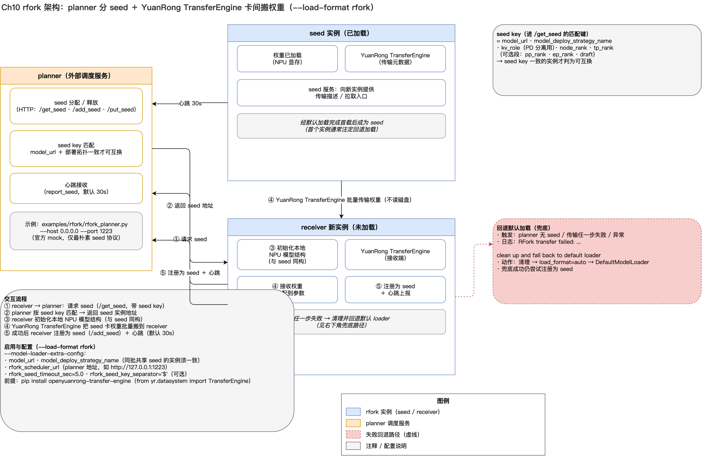

### 操作

两个 loader 的启用方式一样，前提只是装了 vllm-ascend（插件自动把 `rfork` / `netloader` 注册进第 4 节那张分发表）。

**rfork**（以下用演示模型 Qwen3-30B-A3B 举例）：

1. 前提：每个实例装 TransferEngine（`pip install openyuanrong-transfer-engine`）；跑一个 planner（官方 mock：`vllm-ascend/examples/rfork/rfork_planner.py`，默认端口 1223）。
2. 启动命令，extra-config 三个必填字段：

```bash
vllm serve Qwen/Qwen3-30B-A3B --load-format rfork \
  --model-loader-extra-config '{"model_url": "Qwen/Qwen3-30B-A3B", "model_deploy_strategy_name": "tp2_dp2", "rfork_scheduler_url": "http://127.0.0.1:1223"}'
```

- `model_url` + `model_deploy_strategy_name`：模型身份——只有模型与切分都一致的实例才会被当作 seed（`model_deploy_strategy_name` 换成你部署里约定的策略名）；
- `rfork_scheduler_url`：planner 地址。

1. 注意：全新部署的第一个实例注定走磁盘（planner 里还没有 seed），加载完自己变成 seed；之后的实例才真正走传输。

**netloader**（server 端 IP 假设为 `192.168.1.10:55535`）：

1. **server 端**：只要 `--load-format netloader`、不用传 extra-config——它没有 `SOURCE`，会按设计走默认 loader 读盘再开监听（看到 `Did not get valid source info` 日志属正常）：

```bash
vllm serve Qwen/Qwen3-30B-A3B --load-format netloader
```

1. **client 端**：填 `SOURCE` 指向 server 的 IP:port：

```bash
vllm serve Qwen/Qwen3-30B-A3B --load-format netloader \
  --model-loader-extra-config '{"SOURCE": [{"device_id": 0, "sources": ["192.168.1.10:55535"]}]}'
```

（多卡时给每个卡各配一项，`device_id` 是本机卡号、`sources` 是它对应的 server IP:port。）

1. 注意两点：量化模型的 `INT8_CACHE` 默认 `"no"`——需要时显式设 `hbm`/`dram`，否则 int8 参数不做处理可能发散；MTP/draft 模型的监听端口要再 +10000。server 的实际 IP:port 从启动日志读，或设 `OUTPUT_PREFIX` 让每个 rank 写出 `{前缀}{RANK}.txt` 给 client 填。

### 共同行为

传输失败（planner 无 seed、握手不一致、传输出错）都会自动清理并回退默认 loader 读盘——最坏结果只是回到第 5 节那条读盘路径，实例不会起不来。两个 loader 传的都是后处理布局的张量（第 8 节挂载点 3 之后的形态），所以两端必须跑同一份 vllm-ascend 代码；验证时两端起来后用 `temperature=0` 发推理请求对拍输出。

---

## 第 11 节 · 排障实战与收束

> **一句话定义：加载报错就那几类，遇到先分清是读盘、翻译还是切分的问题，再开日志看这条权重到底怎么了。**

加载出错了怎么查？先分清病在哪一环：慢是读盘问题，名字对不上是翻译问题，形状对不上是切分问题。然后开开关、看日志，按下面的顺序缩小范围。

### 先开两个开关

| 开关 | 看什么 |
|---|---|
| `VLLM_LOGGING_LEVEL=DEBUG` | 每条权重最后的结局：装上了 / 被 skip/ignore 跳过 / 压根没被读到 |
| `VLLM_LOG_MODEL_INSPECTION=1` | 实际建出来的模型结构长什么样，和报错的名字对着看 |

（还有一个默认就有的耗时日志 `Loading weights took X seconds`，看读盘慢还是写入慢。）

### 四类报错，看什么、做什么

**漏装**：`Following weights were not initialized from checkpoint: {...}`——模型里有参数没被喂到。查：①DEBUG 里看这条名字是不是被名单跳了；②名字和 mapper 对不对得上（拆开存的 `q_proj/k_proj` 还是融合的 `qkv_proj`）。

**shape 对不上**：`Attempted to load weight (torch.Size([...])) into parameter (torch.Size([...]))`——读出来的形状和参数形状不一致。九成是切分假设错了（某个维度没被卡数整除）。第一招：单卡复现（`-tp 1`、不开 EP）——单卡不报，就是切分问题。

**名字不认识**：`There is no module or parameter named 'xxx' in ...`——checkpoint 里的名字模型里没有。查：①先看 index.json 里这个 key 到底存不存在（文件缺失还是命名不匹配）；②名字风格和 mapper 对不对得上。

**嵌套对不上**：`Attempted to load nested weight 'a.b.c' into a single parameter 'a.b'`——名字比参数多了一层。查 ignore 名单有没有它；没有，就该在模型里建对应的子模块或参数来接它。

### 排查顺序

1. 先看盘：`ls` 分片齐不齐、index.json 里有没有这个 key；
2. 开 DEBUG，看这条权重最后怎么了；
3. 名字对不上查 mapper，形状对不上单卡复现；
4. 都不对，那就是模型实现本身的问题，回到模型代码层看。

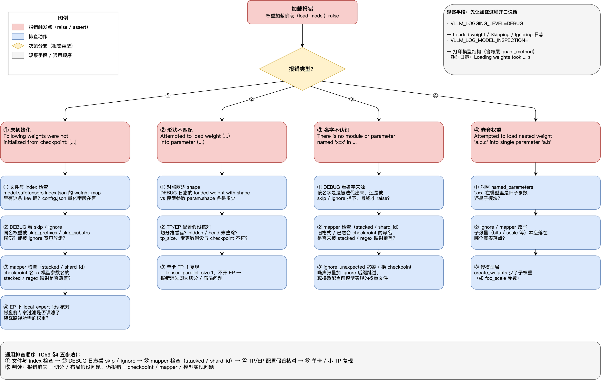

### 回到开头那句话

回到开头那句话——**一份磁盘上的权重文件，变成每张卡上正确的那一块参数**。三个动作各一句：**读**（第 5 节）把磁盘变成一条条 `(name, tensor)`，EP 在读盘前跳过非本地专家；**翻译**（第 6 节）由 WeightsMapper 改名、挂段号，AutoWeightsLoader 顺着模型树写入；**切分**（第 7 节）TP 沿维度切出本 rank 的切片。各环节代码位置都收在附录 A 速查表，新同学日后上手从那张表开始。
